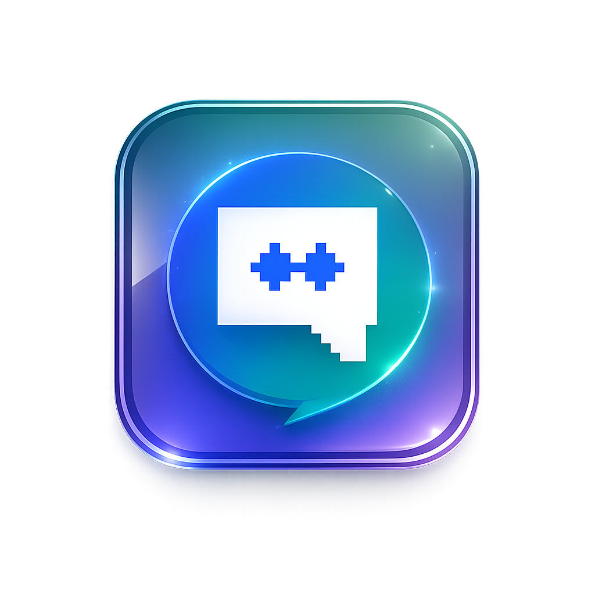

<div align="center">
  
  <h1>LiveChat Pro</h1>

  <p>
    Self-hosted live chat with embeddable widget, Telegram integration, admin panel, SQLite persistence and Docker deployment.
  </p>

  <p>
    <a href="https://www.gnu.org/licenses/gpl-3.0"></a>
    <a href="https://nodejs.org/">=24" src="https://img.shields.io/badge/Node.js-%3E%3D24-339933.svg?logo=node.js&logoColor=white"></a>
    <a href="https://www.docker.com/"></a>
    <a href="https://telegram.org/"></a>
    <a href="https://www.sqlite.org/"></a>
    <a href="https://github.com/wilkinbarban/LiveChat-Pro/releases"></a>
    <a href="#educational-project"></a>
  </p>

  <p>
    <a href="README_ES.md">Español</a> | <a href="README.md">English</a> | <a href="README_BR.md">Português</a>
  </p>
</div>

## Educational Project

> Educational project: this repository is intended for learning, experimentation and technical reference. Review, harden and adapt the configuration before using it in production.

Self-hosted live chat with an embeddable widget, Telegram integration, single web administration panel, SQLite persistence and recommended Docker deployment.

## What It Does

- Adds chat to any website with a single `<script>`.
- Keeps one session per visitor with persistent history.
- Sends visitor messages to Telegram and to the `/admin` web panel.
- Allows replies from Telegram or from the admin panel.
- Shows IP, geolocation, current page, language, user-agent and general metrics.
- Allows clearing, blocking, banning or deleting individual chats.
- Translates messages between the visitor language and the configured admin language.

## Requirements

For local development:

- System Node.js `>=24`
- npm
- Internet access to install dependencies and use automatic translation

For a public VPS:

- Linux with a user that has `sudo`
- System Node.js `>=24`
- Docker Engine + Docker Compose plugin
- Port `8080/tcp` open for LiveChat Pro
- Telegram bot created with [@BotFather](https://t.me/BotFather)
- Your numeric Telegram ID

`setup.js` validates the system Node.js installation before continuing. The `node` command must exist first so the installer can run; if that initial version is older than v24 or does not include `npm`, the installer tries to upgrade to Node.js 24 on supported distributions. On Ubuntu/Debian it removes old `nodejs`/`npm` packages, adds the NodeSource 24.x repository, installs `nodejs`, and then verifies `node --version` and `npm --version`. It also validates Docker/Compose and can install Docker on supported distributions.

The project uses only the system Node.js installation.

## One-command Installation

First make sure the `node` command exists. If the server is fresh and does not have Node.js installed, install the initial package for your distro:

Ubuntu/Debian:

```bash
sudo apt update
sudo apt install -y nodejs npm
```

Fedora:

```bash
sudo dnf install -y nodejs npm
```

CentOS/RHEL/Rocky Linux/AlmaLinux:

```bash
sudo dnf install -y nodejs npm
```

If your system uses `yum`:

```bash
sudo yum install -y nodejs npm
```

Arch Linux:

```bash
sudo pacman -Sy --noconfirm nodejs npm
```

Alpine Linux:

```bash
sudo apk add --no-cache nodejs npm
```

Then run the one-command installation:

```bash
git clone https://github.com/wilkinbarban/LiveChat-Pro.git && cd LiveChat-Pro && node setup.js
```

If that first package installs an old Node.js version, such as Ubuntu's `v12.22.9`, the installer will try to upgrade it to Node.js 24 first and then continue with the guided setup.

## Local Quick Start

```bash
sudo npm install
node setup.js
sudo node server.js
```

Then open:

- Widget demo: `http://localhost:3000/`
- Admin panel: `http://localhost:3000/admin`
- Status: `http://localhost:3000/health`

## Recommended VPS Installation

```bash
git clone https://github.com/wilkinbarban/LiveChat-Pro.git && cd LiveChat-Pro && node setup.js
```

During the assistant, choose:

```text
Deployment profile: Public VPS with Docker
Startup mode: Docker with docker compose up -d
```

That profile configures:

```env
PORT="3000"
HOST_PORT="8080"
```

Node listens inside the container on `3000`, but Docker publishes the project to the internet on `8080`. This port is the recommended option so `80` and `443` remain free for your public website or for an HTTPS proxy.

If you do not have a domain yet, `setup.js` detects the public VPS IP and generates a script like:

```html
<script src="http://PUBLIC-IP:8080/widget.js" data-server="http://PUBLIC-IP:8080"></script>
```

If you have a domain, enter it when the assistant asks for domain/allowed origins:

```text
mydomain.com
https://chat.mydomain.com
```

At the end, the installer shows the demo URL, admin panel, healthcheck and the final `<script>` to paste into the external website.

To skip system checks in CI or tests:

```bash
LIVECHAT_SKIP_SYSTEM_CHECKS=1 node setup.js
```

If `setup.js` fails while validating elevated permissions, run the installer from an interactive terminal so `sudo` can ask for the password. In automated runs you can validate first with:

```bash
sudo -v
node setup.js
```

If your user does not have sudo permissions, log in as root or add the user to the sudo/wheel group before installing Node.js, Docker or opening the firewall.

## Docker

If you already have `.env` configured:

```bash
docker compose up -d --build
docker compose ps
docker compose logs -f livechat
```

With `HOST_PORT=8080`, check:

```bash
curl http://localhost:8080/health
```

In Docker, the internal `/app/data` directory is mounted on the `livechat_data` volume. Therefore, the real SQLite database used by the container lives inside that volume as `/app/data/livechat.db` and survives restarts and rebuilds.

Important: the `data/livechat.db` file you may see in the project directory belongs to local runs without Docker or to old host data. It is not necessarily the database used by the container. To inspect the active Docker database, enter the container or copy the file from the volume/container.

Update:

```bash
git pull
docker compose up -d --build
```

Stop:

```bash
docker compose down
```

Remove containers and persistent data:

```bash
docker compose down -v
```

## Without Docker

```bash
sudo npm install
node setup.js
sudo node server.js
```

With PM2:

```bash
npm install -g pm2
pm2 start server.js --name livechat-pro
pm2 startup
pm2 save
```

## Environment Variables

The `.env` file is generated by `node setup.js`. You can also create it manually.

| Variable | Required | Description |
|---|---:|---|
| `TELEGRAM_TOKEN` | Yes | Telegram bot token |
| `TELEGRAM_ADMIN_ID` | Yes | Numeric Telegram admin ID |
| `ADMIN_PANEL_PASSWORD` | Yes | Password for `/admin` |
| `ADMIN_LANGUAGE` | No | Admin language: `es`, `en`, `pt`, `fr`, `de`, `it` |
| `PORT` | No | Internal Node port. Default: `3000` |
| `HOST_PORT` | No | Port published by Docker. On a public VPS use `8080` to keep `80`/`443` free |
| `ALLOWED_ORIGINS` | No | Allowed CORS origins, comma-separated |
| `ADMIN_SESSION_TTL_HOURS` | No | Admin session duration. Default: `12` |
| `COOKIE_SAME_SITE` | No | Admin cookie SameSite policy: `lax`, `strict` or `none`. Default: `lax`; `none` requires HTTPS |
| `LOG_LEVEL` | No | `fatal`, `error`, `warn`, `info`, `debug`, `trace` |
| `DB_PATH` | No | SQLite path. Default: `data/livechat.db` |
| `WIDGET_PRIMARY_COLOR` | No | Main widget color |
| `WIDGET_BUTTON_STYLE` | No | `floating`, `persistent` or `hidden` |
| `WIDGET_WELCOME_MESSAGE` | No | Fixed message. Empty enables the automatic greeting by language |
| `WIDGET_API_KEY` | No | Optional widget credential. If set, the client must send it in `data-api-key` or the server will reject the chat connection |
| `FEATURE_TRANSLATION` | No | `true`/`false` |
| `TRANSLATION_PROVIDER` | No | Translation provider: `google_free`, `google_cloud` or `deepl`. Default: `google_free` |
| `TRANSLATION_API_KEY` | No | API key for `google_cloud` or `deepl`; if missing, the free fallback is used |
| `FEATURE_GEOLOCATION` | No | `true`/`false` |
| `FEATURE_SENTIMENT` | No | `true`/`false` |
| `FEATURE_GHOST_TYPING` | No | `true`/`false` |
| `REDIS_URL` | No | Redis for shared state/Socket.IO multi-node |
| `REDIS_KEY_PREFIX` | No | Redis key prefix. Default: `lcp` |
| `RATE_LIMIT_WINDOW_MINUTES` | No | Rate limit window. Default: `15` |
| `RATE_LIMIT_PUBLIC_MAX` | No | Maximum for public routes like `widget.js` and `/config-public`. Default: `300` |
| `RATE_LIMIT_ADMIN_MAX` | No | Maximum for unauthenticated admin. Authenticated admin is excluded. Default: `2000` |
| `RATE_LIMIT_LOGIN_MAX` | No | Maximum attempts to `/api/admin/login`. Default: `20` |
| `TRUST_PROXY_HOPS` | No | Trusted proxy hops for the real IP. Default: `1` |

IP-based VPS example:

```env
PORT="3000"
HOST_PORT="8080"
ALLOWED_ORIGINS="http://185.194.221.162:8080"
```

HTTPS domain example:

```env
PORT="3000"
HOST_PORT="8080"
ALLOWED_ORIGINS="https://chat.mydomain.com"
```

## Widget

Paste the script generated by `setup.js` into the website where you want to show the chat:

```html
<script src="https://chat.mydomain.com/widget.js" data-server="https://chat.mydomain.com"></script>
```

If you configured `WIDGET_API_KEY`:

```html
<script src="https://chat.mydomain.com/widget.js" data-server="https://chat.mydomain.com" data-api-key="YOUR_API_KEY"></script>
```

`WIDGET_API_KEY` lets only sites that have your full snippet start chat connections. It does not replace CORS or make the widget private, because any key placed in HTML can be viewed from the browser, but it helps avoid accidental integrations or clients without the expected credential.

Example `.env`:

```env
WIDGET_API_KEY="long-random-key-for-my-site"
```

Example script on your site:

```html
<script
  src="https://chat.mydomain.com/widget.js"
  data-server="https://chat.mydomain.com"
  data-api-key="long-random-key-for-my-site">
</script>
```

If you choose `WIDGET_BUTTON_STYLE="hidden"` or the `Hidden, to open it by code` option in `setup.js`, the widget loads but does not show the floating button. You can open the chat with your own button:

```html
<script src="https://chat.mydomain.com/widget.js" data-server="https://chat.mydomain.com"></script>

<button type="button" onclick="document.getElementById('lcp-btn')?.click()">
  Open chat
</button>
```

With `WIDGET_API_KEY` and hidden button:

```html
<script
  src="https://chat.mydomain.com/widget.js"
  data-server="https://chat.mydomain.com"
  data-api-key="long-random-key-for-my-site">
</script>

<button type="button" onclick="document.getElementById('lcp-btn')?.click()">
  Open chat
</button>
```

The widget stores the visitor session with `localStorage` and the `lchat_sid` cookie.

### Responsive Widget Behavior

The widget automatically detects the mobile mode of the site where it is installed with `window.matchMedia`. By default, it enters mobile mode when the viewport is `768px` or less. If the browser does not support `matchMedia`, it uses `window.innerWidth` as a fallback.

When the screen size changes or the user rotates the device, the widget updates its internal `lcp-mobile` class without reloading the page. On desktop it remains a floating window; on mobile it stops floating and becomes a fixed bottom menu-style bar.

When opened on mobile, the chat uses a controlled full-screen view: fixed header, messages with internal scroll and fixed input at the bottom. This prevents the chat window from being taller than the visible site resolution.

With `data-theme="auto"`, the widget takes the font, text color, base background and accent from the site where it is inserted. This prevents the opened chat from looking visually disconnected in mobile mode.

The message input keeps explicit foreground, placeholder and caret colors. In dark host pages, the focused field keeps the dark input background instead of switching to a light field, so typed text remains readable while the visitor writes.

When the chat opens on mobile, the panel is limited with `visualViewport` when the browser supports it. This keeps the message area and input within the visible screen, even when the mobile keyboard appears. The widget internal CSS is encapsulated with Shadow DOM to reduce conflicts with site styles.

You can customize the behavior per site with script attributes:

```html
<script
  src="https://chat.mydomain.com/widget.js"
  data-server="https://chat.mydomain.com"
  data-mobile-breakpoint="820"
  data-mobile-mode="dock"
  data-mobile-width="100"
  data-mobile-focused-width="94"
  data-mobile-focused-height="76"
  data-theme="auto"
  data-position="bottom-right">
</script>
```

Available options:

- `data-mobile-breakpoint`: maximum width considered mobile. Default: `768`.
- `data-mobile-mode`: `dock`, `compact`, `bottom-sheet` or `fullscreen`. Default: `dock`.
- `data-mobile-width`: open panel width on mobile, as a viewport percentage. Default: `100`. Allowed range: `70` to `100`.
- `data-mobile-focused-width`: mobile panel width when the text field is focused and the keyboard appears, as a viewport percentage. Default: `94`. Allowed range: `70` to `100`.
- `data-mobile-focused-height`: maximum mobile panel height when the text field is focused and the keyboard appears, as a visible viewport percentage. Default: `76`. Allowed range: `50` to `95`.
- `data-theme`: `auto` inherits font, text, background and visual tone from the site; `classic` uses the widget brand design.
- `data-position`: `bottom-right` or `bottom-left`.

For a mobile site where the keyboard covers too much history, you can reduce the focused panel slightly:

```html
<script
  src="https://chat.mydomain.com/widget.js"
  data-server="https://chat.mydomain.com"
  data-mobile-mode="dock"
  data-mobile-focused-width="92"
  data-mobile-focused-height="68">
</script>
```

You can also define them before the script with `window.LiveChatConfig`:

```html
<script>
  window.LiveChatConfig = {
    mobileBreakpoint: 820,
    mobileMode: 'dock',
    mobileWidth: 100,
    mobileFocusedWidth: 92,
    mobileFocusedHeight: 68,
    theme: 'auto',
    position: 'bottom-left'
  };
</script>
<script src="https://chat.mydomain.com/widget.js" data-server="https://chat.mydomain.com"></script>
```

## Admin Panel

Access:

```text
http://YOUR_IP:8080/admin
https://chat.mydomain.com/admin
```

The panel is designed for a single system admin, without external staff flows.

Features:

- View all chats by user.
- Search by name, ID, IP, country or page.
- View geolocation, IP, ISP, language, current page and user-agent.
- View general metrics for users, connected, disconnected, messages and blocks.
- Reply to the user.
- Clear individual chat.
- Block or ban user.
- Delete session and messages.

### Admin Panel Visual Behavior

The admin panel keeps the light theme as the default visual style. Input and textarea fields define explicit text, placeholder and caret colors, and force a light input color scheme when the browser or operating system is in dark mode. This prevents light-on-light or browser-inverted field colors while preserving the original light panel design.

Admin action buttons include hover, active and keyboard focus states. Primary, warning, destructive and soft buttons use subtle gradients, elevation and border changes to make actions easier to scan without changing the panel layout.

### Current Admin API

| Method | Route | Description |
|---|---|---|
| `GET` | `/api/admin/me` | Authentication status |
| `POST` | `/api/admin/login` | Log in |
| `POST` | `/api/admin/logout` | Log out |
| `GET` | `/api/admin/sessions` | List sessions |
| `GET` | `/api/admin/sessions/:id` | Session and message detail |
| `POST` | `/api/admin/sessions/:id/message` | Reply to the user |
| `POST` | `/api/admin/sessions/:id/typing` | Admin typing indicator |
| `POST` | `/api/admin/sessions/:id/read` | Mark as read |
| `GET` | `/api/admin/metrics/general` | General metrics |
| `POST` | `/api/admin/sessions/:id/clear` | Clear chat |
| `POST` | `/api/admin/sessions/:id/block` | Block user |
| `POST` | `/api/admin/sessions/:id/ban` | Ban user |
| `DELETE` | `/api/admin/sessions/:id` | Delete session |

Mutating actions use CSRF protection with the `lcp_csrf` cookie and `x-csrf-token` header.

The rate limit is separated by zone:

- Admin login: protected by `RATE_LIMIT_LOGIN_MAX`.
- Public widget routes: protected by `RATE_LIMIT_PUBLIC_MAX`.
- Unauthenticated admin API: protected by `RATE_LIMIT_ADMIN_MAX`.
- Authenticated admin: does not consume the admin limiter quota.

## Telegram

| Command | Description |
|---|---|
| `/usuarios` | Lists active users |
| `/ban [id]` | Bans by `sessionId` prefix |
| `/info [id]` | Shows IP, location, user-agent and page |
| `/clean` | Deletes inactive sessions without messages |

To reply from Telegram, reply directly to the message that arrived for that session.

## Translation and Languages

The widget detects the visitor browser language and stores it in the session.

Supported automatic greetings:

| Language | Code |
|---|---|
| Spanish | `es` |
| English | `en` |
| Portuguese | `pt` |

The admin can work in:

```text
es, en, pt, fr, de, it
```

Flow:

1. Visitor writes in their language.
2. The admin sees the message translated to `ADMIN_LANGUAGE`.
3. The admin replies.
4. The reply is translated to the session language.
5. The visitor receives the reply in their language.

Translation depends on `FEATURE_TRANSLATION="true"`.

## Architecture

```text
Web visitor
  │
  │ Socket.IO
  ▼
server.js
  ├─ Express REST
  ├─ Socket.IO widget
  ├─ Socket.IO /admin
  ├─ Telegraf Telegram
  └─ db.js SQLite
        ▼
   /app/data/livechat.db
   ▲ inside Docker: livechat_data volume mounted at /app/data
```

In a local run without Docker, the default path is `data/livechat.db` inside the project directory.

Message flow:

1. The widget connects through Socket.IO.
2. The server creates or restores the session.
3. The message is saved in SQLite.
4. The message is sent to Telegram and to the admin panel.
5. The admin replies from Telegram or `/admin`.
6. The server translates if needed.
7. The visitor receives the reply through Socket.IO.

## Optional Redis

Docker Compose includes Redis and configures:

```env
REDIS_URL="redis://redis:6379"
REDIS_KEY_PREFIX="lcp"
```

Redis is used for presence, shared state and the Socket.IO adapter when there are multiple nodes.

For local installation without Docker:

```env
REDIS_URL="redis://127.0.0.1:6379"
```

If `/health` returns `stateMode: "redis"`, Redis is active.

## Nginx and HTTPS

For a real domain with HTTPS you can use the included file:

```bash
sudo cp nginx/livechat.conf /etc/nginx/sites-available/livechat
sudo ln -s /etc/nginx/sites-available/livechat /etc/nginx/sites-enabled/
sudo nginx -t
sudo systemctl reload nginx
```

Certificate with Certbot:

```bash
sudo certbot --nginx -d chat.mydomain.com
```

Then adjust:

```env
ALLOWED_ORIGINS="https://chat.mydomain.com"
```

Admin cookies are marked as `Secure` when the request arrives through HTTPS or through a proxy with `X-Forwarded-Proto: https`. In development over HTTP by IP, they work without `Secure`.

Admin geolocation depends on Node receiving the visitor real public IP. The `nginx/livechat.conf` template already sends `X-Real-IP` and `X-Forwarded-For`; if the panel shows `127.x`, `10.x`, `172.16-31.x` or `192.168.x` IPs, the server is seeing a private Docker/proxy IP and the location will appear as unknown. In that case, use Nginx/HTTPS in front of the container or verify that the proxy preserves those headers.

## Main Files

```text
server.js           Express, Socket.IO and Telegram server
widget.js           Embeddable widget
setup.js            Interactive installer
db.js               SQLite persistence
cluster-state.js    Optional shared state with Redis
public/index.html   Widget demo
public/admin.html   Single admin panel
docker-compose.yml  App + Redis + volumes
Dockerfile          Production image
nginx/livechat.conf HTTPS reverse proxy
tests/              Automated tests
data/livechat.db    SQLite database in local runs without Docker
```

## Tests

```bash
npm test
npm run test:db
npm run test:api
```

Tests use `node:test` and in-memory SQLite to avoid touching real data.

## System Status

```text
/health
/health?format=json
```

Shows general status, in-memory sessions, state mode (`memory` or `redis`), Telegram, uptime, public widget configuration and active features.

## Security

- Use a strong password for `ADMIN_PANEL_PASSWORD`.
- In production with a domain, use HTTPS.
- Restrict `ALLOWED_ORIGINS` to the real domain.
- Open only the required ports on the VPS.
- If you use `WIDGET_API_KEY`, the widget must include `data-api-key`.

## Implemented Features

- Real-time chat with Socket.IO.
- Embeddable widget.
- Single admin panel.
- Telegram integration.
- SQLite persistence.
- General metrics.
- Clearing, blocking, banning and deletion by chat.
- Automatic translation.
- IP geolocation.
- Read receipts.
- Ghost typing to Telegram.
- HTTP and socket rate limiting.
- Helmet and CSRF on admin actions.
- Docker Compose with Redis.
- Interactive setup for public VPS or local development.
- Automated test suite.

## Project Documentation

- [Spanish README](README_ES.md)
- [Portuguese README](README_BR.md)
- [Documentation index](docs/README.md)
- [Contributing guide](CONTRIBUTING.md)
- [Security policy](SECURITY.md)
- [GPL license](LICENSE)
