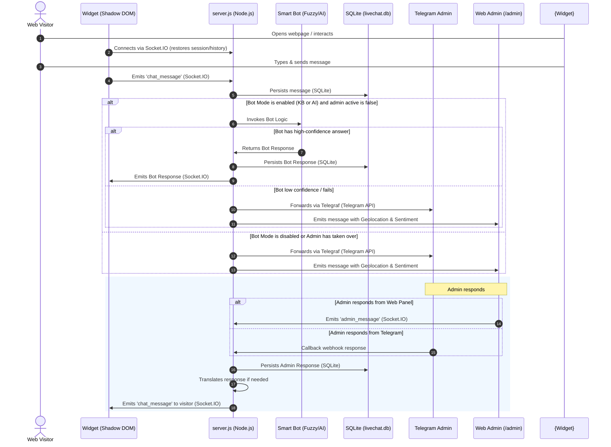

<div align="center">
  
  <h1>LiveChat Pro</h1>

  <p>
    Self-hosted live chat with embeddable widget, Telegram integration, admin panel, SQLite persistence and Docker deployment.
  </p>

  <p>
    <a href="https://www.gnu.org/licenses/gpl-3.0"></a>
    <a href="https://nodejs.org/">=24" src="https://img.shields.io/badge/Node.js-%3E%3D24-339933.svg?logo=node.js&logoColor=white"></a>
    <a href="https://www.docker.com/"></a>
    <a href="https://telegram.org/"></a>
    <a href="https://www.sqlite.org/"></a>
    <a href="https://github.com/wilkinbarban/LiveChat-Pro/releases"></a>
    <a href="#educational-project"></a>
  </p>

  <p>
    <a href="README_ES.md">Español</a> | <a href="README.md">English</a> | <a href="README_BR.md">Português</a>
  </p>
</div>

## Educational Project

> Educational project: this repository is intended for learning, experimentation and technical reference. Review, harden and adapt the configuration before using it in production.

Self-hosted live chat with an embeddable widget, Telegram integration, single web administration panel, SQLite persistence and recommended Docker deployment.

## What It Does

- Adds chat to any website with a single `<script>`.
- Keeps one session per visitor with persistent history.
- Sends visitor messages to Telegram and to the `/admin` web panel.
- Allows replies from Telegram or from the admin panel.
- Shows IP, geolocation, current page, language, user-agent and general metrics.
- Allows clearing, blocking, banning or deleting individual chats.
- Translates messages between the visitor language and the configured admin language.

## Requirements

For local development:

- System Node.js `>=24`
- npm
- Internet access to install dependencies and use automatic translation

For a public VPS:

- Linux with a user that has `sudo`
- System Node.js `>=24`
- Docker Engine + Docker Compose plugin
- Your numeric Telegram ID

System dependencies are validated and installed automatically by native installation scripts:
- **Linux (Docker-based):** `install.sh` verifies/installs Node.js >= 24, npm, and Docker.
- **Windows (Node-based):** `install.ps1` verifies/installs Node.js >= 24, npm, and runs `npm install`.

## One-Click Installation

To quickly set up the environment, verify dependencies, clone the project repository, and launch the interactive configuration assistant, run the appropriate command for your operating system:

### Linux
```bash
curl -fsSL https://raw.githubusercontent.com/wilkinbarban/AI-Workspace-Manager/main/install.sh | bash
```

### Windows (Elevated PowerShell)
Open PowerShell as an Administrator and execute:
```powershell
powershell -NoProfile -ExecutionPolicy Bypass -Command "irm https://raw.githubusercontent.com/wilkinbarban/AI-Workspace-Manager/main/install.ps1 | iex"
```

---

### Detailed Installation Process: What These Scripts Do

#### Linux Installer (`install.sh`)
When you execute the automated Linux installer, it performs the following sequence in detail:
1. **Administrative Check**: Verifies if the script runs as root or via `sudo`. System-level package managers require administrative privileges.
2. **Distribution & Package Manager Identification**: Detects the Linux distribution to invoke the correct package manager (e.g., `apt` for Debian/Ubuntu, `yum`/`dnf` for RHEL/CentOS, or `pacman` for Arch).
3. **Prerequisite Check & System Setup**:
   - **Git**: Checks if `git` is available. If missing, it installs it via the package manager.
   - **Node.js & npm**: Checks for Node.js (version 24 or newer). If missing or outdated, it configures NodeSource repos or the OS package manager to install the correct runtime along with `npm`.
   - **Docker & Docker Compose**: Verifies if the Docker engine and Docker Compose plugin are installed. If missing, it installs them, starts the Docker service, and configures it to start on boot.
4. **Project Directory Check**: Verifies if `setup.js` exists in the current folder. If it is not found, the script automatically clones the repository from `https://github.com/wilkinbarban/LiveChat-Pro.git` into a folder named `LiveChat-Pro` and navigates into it.
5. **Interactive Setup Wizard**: Executes `node setup.js` to prompt you for environment settings, generating a custom `.env` file containing all the parameters.
6. **Container Build and Startup**: Offers to build and run the services immediately using `docker compose up -d --build`.
7. **Execution Logging**: Redirects verbose outputs of all checks and installations to `install.log` while showing a clean animated progress indicator in the terminal.

#### Windows Installer (`install.ps1`)
When you execute the automated Windows PowerShell installer, it runs the following steps:
1. **Elevated Privilege Check**: Asserts that the current PowerShell session has Administrator privileges, which are required for system-level adjustments.
2. **Dependency Verification & Automatic Installation**:
   - **Git**: Inspects if Git is installed. If missing, it uses `winget` (Windows Package Manager) to install it, or downloads it directly if `winget` is not available.
   - **Node.js & npm**: Checks for Node.js (version 24 or higher). If missing, it downloads and executes the official MSI installer silently, updating environment paths.
3. **Project Directory Check**: Searches for `setup.js`. If absent, it invokes Git to clone the project from `https://github.com/wilkinbarban/LiveChat-Pro.git` and navigates into the folder.
4. **Direct Dependency Resolution (npm install)**: Runs `npm install` directly on the host operating system to install the required Node.js libraries.
5. **Wizard Launch**: Launches the interactive configuration assistant (`node setup.js`) to set up your Telegram bot token, administrator credentials, and preferences.
6. **Optional Host Server Startup**: At the end of the configuration, the script asks if you want to start the live chat server directly using Node (`node server.js`).
7. **Docker-Free Architecture**:
   > [!IMPORTANT]
   > LiveChat Pro on Windows is designed to run natively. **It does not require, use, or install Docker, Docker Desktop, or any containerization services on Windows**. The entire server, database, and background tasks run directly on the host Windows system as standard Node.js processes.
8. **Logging**: All installer console output is logged in the background to `install.log` for troubleshooting.

---

## Recommended VPS Installation

Run the native script according to your OS:
```bash
chmod +x install.sh
./install.sh
```
At the end of the dependency installation, the `setup.js` wizard will start. During the wizard:
1. Choose **Basic Setup** (for quick configuration) or **Full Setup** (to customize all 43 parameters).
2. Follow the prompts for Telegram bot credentials, admin panel password, and origins.
3. When asked, choose **Yes** to build and start the server automatically using Docker Compose.

The VPS configuration will map:
```env
PORT="3000"
HOST_PORT="8080"
```
Node listens inside the container on `3000`, but Docker publishes the project to the internet on `8080`. This port is the recommended option so `80` and `443` remain free for your public website or for an HTTPS proxy.

If you do not have a domain yet, `setup.js` detects the public VPS IP and generates a script like:

```html
<script src="http://PUBLIC-IP:8080/widget.js" data-server="http://PUBLIC-IP:8080"></script>
```

If you have a domain, enter it when the assistant asks for domain/allowed origins. At the end, the installer shows the demo URL, admin panel, healthcheck and the final `<script>` to paste into the external website.

If your user does not have sudo permissions, log in as root or add the user to the sudo/wheel group before running the installer.

---

## Manual Installation (Alternative)

If you prefer not to use the automated scripts, you can set up the project manually step-by-step:

### Linux (Docker-based / Production)
1. **Install Prerequisites**: Ensure your system has Git, Node.js (>=24), npm, Docker, and Docker Compose installed.
   - For example, on Ubuntu/Debian:
     ```bash
     sudo apt update
     sudo apt install -y git nodejs npm docker.io docker-compose-v2
     ```
2. **Clone the Repository**:
   ```bash
   git clone https://github.com/wilkinbarban/LiveChat-Pro.git
   cd LiveChat-Pro
   ```
3. **Install Project Dependencies**:
   ```bash
   npm install
   ```
4. **Configure Environment Variables**:
   Run the interactive CLI setup tool to answer configuration prompts and generate `.env`:
   ```bash
   node setup.js
   ```
5. **Launch the Application Services**:
   Build and launch the Docker container services in detached mode:
   ```bash
   docker compose up -d --build
   ```
6. **Verify Running State**:
   ```bash
   curl http://localhost:8080/health
   ```

### Windows (Node-based / Direct Host)
1. **Install Prerequisites**: Download and install Git from [git-scm.com](https://git-scm.com/) and Node.js (version 24 or newer) from [nodejs.org](https://nodejs.org/).
   > [!NOTE]
   > LiveChat Pro on Windows does not require, use, or install Docker. It executes natively directly on your operating system.
2. **Clone the Repository**:
   Open PowerShell or Command Prompt and run:
   ```powershell
   git clone https://github.com/wilkinbarban/LiveChat-Pro.git
   cd LiveChat-Pro
   ```
3. **Install Dependencies**:
   ```powershell
   npm install
   ```
4. **Run Configuration Wizard**:
   ```powershell
   node setup.js
   ```
   Follow the prompt questions to generate your `.env` file.
5. **Start the Server**:
   ```powershell
   node server.js
   ```
   The server will start listening on the port configured in `.env` (default is `3000`).

---

## WSL on Windows

On WSL you can run LiveChat Pro with local Node or with Docker. The most stable Docker option is Docker Desktop with WSL integration:

```bash
docker info
docker compose version
```

If those commands work inside the WSL distro, run `node setup.js` and choose Docker mode. If they fail, open Docker Desktop on Windows and enable `Settings > Resources > WSL integration` for your distro.

If you prefer Docker Engine inside WSL, enable systemd:

```bash
sudo sh -c 'printf "[boot]\nsystemd=true\n" > /etc/wsl.conf'
wsl.exe --shutdown
```

Then reopen the distro and run:

```bash
sudo systemctl enable --now docker
docker info
```

WSL without systemd does not use the classic `/etc/init.d/docker` scripts; if Docker is not available, choose local Node/npm mode.

## Docker

If you already have `.env` configured:

```bash
docker compose up -d --build
docker compose ps
docker compose logs -f livechat
```

With `HOST_PORT=8080`, check:

```bash
curl http://localhost:8080/health
```

In Docker, the internal `/app/data` directory is mounted on the `livechat_data` volume. Therefore, the real SQLite database used by the container lives inside that volume as `/app/data/livechat.db` and survives restarts and rebuilds.

Important: the `data/livechat.db` file you may see in the project directory belongs to local runs without Docker or to old host data. It is not necessarily the database used by the container. To inspect the active Docker database, enter the container or copy the file from the volume/container.

Update:

```bash
git pull
docker compose up -d --build
```

Stop:

```bash
docker compose down
```

Remove containers and persistent data:

```bash
docker compose down -v
```

## Without Docker (Linux Local Dev / PM2)
If you are running the project directly on a Linux host without Docker:

```bash
npm install
node setup.js
node server.js
```

With PM2:

```bash
npm install -g pm2
pm2 start server.js --name livechat-pro
pm2 startup
pm2 save
```

## Environment Variables

The `.env` file is generated by `node setup.js`. You can also create it manually.

| Variable | Required | Description |
|---|---:|---|
| `TELEGRAM_TOKEN` | Yes | Telegram bot token |
| `TELEGRAM_ADMIN_ID` | Yes | Numeric Telegram admin ID |
| `ADMIN_PANEL_PASSWORD` | Yes | Password for `/admin` |
| `ADMIN_LANGUAGE` | No | Admin language: `es`, `en`, `pt`, `fr`, `de`, `it` |
| `PORT` | No | Internal Node port. Default: `3000` |
| `HOST_PORT` | No | Port published by Docker. On a public VPS use `8080` to keep `80`/`443` free |
| `ALLOWED_ORIGINS` | No | Allowed CORS origins, comma-separated |
| `ADMIN_SESSION_TTL_HOURS` | No | Admin session duration. Default: `12` |
| `COOKIE_SAME_SITE` | No | Admin cookie SameSite policy: `lax`, `strict` or `none`. Default: `lax`; `none` requires HTTPS |
| `LOG_LEVEL` | No | `fatal`, `error`, `warn`, `info`, `debug`, `trace` |
| `DB_PATH` | No | SQLite path. Default: `data/livechat.db` |
| `WIDGET_PRIMARY_COLOR` | No | Main widget color |
| `WIDGET_BUTTON_STYLE` | No | `floating`, `persistent` or `hidden` |
| `WIDGET_WELCOME_MESSAGE` | No | Fixed message. Empty enables the automatic greeting by language |
| `WIDGET_API_KEY` | No | Optional widget credential. If set, the client must send it in `data-api-key` or the server will reject the chat connection |
| `FEATURE_TRANSLATION` | No | `true`/`false` |
| `TRANSLATION_PROVIDER` | No | Translation provider: `google_free`, `google_cloud` or `deepl`. Default: `google_free` |
| `TRANSLATION_API_KEY` | No | API key for `google_cloud` or `deepl`; if missing, the free fallback is used |
| `FEATURE_GEOLOCATION` | No | `true`/`false` |
| `FEATURE_SENTIMENT` | No | `true`/`false` |
| `FEATURE_GHOST_TYPING` | No | `true`/`false` |
| `REDIS_URL` | No | Redis for shared state/Socket.IO multi-node |
| `REDIS_KEY_PREFIX` | No | Redis key prefix. Default: `lcp` |
| `RATE_LIMIT_WINDOW_MINUTES` | No | Rate limit window. Default: `15` |
| `RATE_LIMIT_PUBLIC_MAX` | No | Maximum for public routes like `widget.js` and `/config-public`. Default: `300` |
| `RATE_LIMIT_ADMIN_MAX` | No | Maximum for unauthenticated admin. Authenticated admin is excluded. Default: `2000` |
| `RATE_LIMIT_LOGIN_MAX` | No | Maximum attempts to `/api/admin/login`. Default: `20` |
| `TRUST_PROXY_HOPS` | No | Trusted proxy hops for the real IP. Default: `1` |

IP-based VPS example:

```env
PORT="3000"
HOST_PORT="8080"
ALLOWED_ORIGINS="http://185.194.221.162:8080"
```

HTTPS domain example:

```env
PORT="3000"
HOST_PORT="8080"
ALLOWED_ORIGINS="https://chat.mydomain.com"
```

## Widget

Paste the script generated by `setup.js` into the website where you want to show the chat:

```html
<script src="https://chat.mydomain.com/widget.js" data-server="https://chat.mydomain.com"></script>
```

If you configured `WIDGET_API_KEY`:

```html
<script src="https://chat.mydomain.com/widget.js" data-server="https://chat.mydomain.com" data-api-key="YOUR_API_KEY"></script>
```

`WIDGET_API_KEY` lets only sites that have your full snippet start chat connections. It does not replace CORS or make the widget private, because any key placed in HTML can be viewed from the browser, but it helps avoid accidental integrations or clients without the expected credential.

Example `.env`:

```env
WIDGET_API_KEY="long-random-key-for-my-site"
```

Example script on your site:

```html
<script
  src="https://chat.mydomain.com/widget.js"
  data-server="https://chat.mydomain.com"
  data-api-key="long-random-key-for-my-site">
</script>
```

If you choose `WIDGET_BUTTON_STYLE="hidden"` or the `Hidden, to open it by code` option in `setup.js`, the widget loads but does not show the floating button. You can open the chat with your own button:

```html
<script src="https://chat.mydomain.com/widget.js" data-server="https://chat.mydomain.com"></script>

<button type="button" onclick="document.getElementById('lcp-btn')?.click()">
  Open chat
</button>
```

With `WIDGET_API_KEY` and hidden button:

```html
<script
  src="https://chat.mydomain.com/widget.js"
  data-server="https://chat.mydomain.com"
  data-api-key="long-random-key-for-my-site">
</script>

<button type="button" onclick="document.getElementById('lcp-btn')?.click()">
  Open chat
</button>
```

The widget stores the visitor session with `localStorage` and the `lchat_sid` cookie.

### Responsive Widget Behavior

The widget automatically detects the mobile mode of the site where it is installed with `window.matchMedia`. By default, it enters mobile mode when the viewport is `768px` or less. If the browser does not support `matchMedia`, it uses `window.innerWidth` as a fallback.

When the screen size changes or the user rotates the device, the widget updates its internal `lcp-mobile` class without reloading the page. On desktop it remains a floating window; on mobile it stops floating and becomes a fixed bottom menu-style bar.

When opened on mobile, the chat uses a controlled full-screen view: fixed header, messages with internal scroll and fixed input at the bottom. This prevents the chat window from being taller than the visible site resolution.

With `data-theme="auto"`, the widget takes the font, text color, base background and accent from the site where it is inserted. This prevents the opened chat from looking visually disconnected in mobile mode.

The message input keeps explicit foreground, placeholder and caret colors. In dark host pages, the focused field keeps the dark input background instead of switching to a light field, so typed text remains readable while the visitor writes.

When the chat opens on mobile, the panel is limited with `visualViewport` when the browser supports it. This keeps the message area and input within the visible screen, even when the mobile keyboard appears. The widget internal CSS is encapsulated with Shadow DOM to reduce conflicts with site styles.

You can customize the behavior per site with script attributes:

```html
<script
  src="https://chat.mydomain.com/widget.js"
  data-server="https://chat.mydomain.com"
  data-mobile-breakpoint="820"
  data-mobile-mode="dock"
  data-mobile-width="100"
  data-mobile-focused-width="94"
  data-mobile-focused-height="76"
  data-theme="auto"
  data-position="bottom-right">
</script>
```

Available options:

- `data-mobile-breakpoint`: maximum width considered mobile. Default: `768`.
- `data-mobile-mode`: `dock`, `compact`, `bottom-sheet` or `fullscreen`. Default: `dock`.
- `data-mobile-width`: open panel width on mobile, as a viewport percentage. Default: `100`. Allowed range: `70` to `100`.
- `data-mobile-focused-width`: mobile panel width when the text field is focused and the keyboard appears, as a viewport percentage. Default: `94`. Allowed range: `70` to `100`.
- `data-mobile-focused-height`: maximum mobile panel height when the text field is focused and the keyboard appears, as a visible viewport percentage. Default: `76`. Allowed range: `50` to `95`.
- `data-theme`: `auto` inherits font, text, background and visual tone from the site; `classic` uses the widget brand design.
- `data-position`: `bottom-right` or `bottom-left`.

For a mobile site where the keyboard covers too much history, you can reduce the focused panel slightly:

```html
<script
  src="https://chat.mydomain.com/widget.js"
  data-server="https://chat.mydomain.com"
  data-mobile-mode="dock"
  data-mobile-focused-width="92"
  data-mobile-focused-height="68">
</script>
```

You can also define them before the script with `window.LiveChatConfig`:

```html
<script>
  window.LiveChatConfig = {
    mobileBreakpoint: 820,
    mobileMode: 'dock',
    mobileWidth: 100,
    mobileFocusedWidth: 92,
    mobileFocusedHeight: 68,
    theme: 'auto',
    position: 'bottom-left'
  };
</script>
<script src="https://chat.mydomain.com/widget.js" data-server="https://chat.mydomain.com"></script>
```

## Admin Panel

Access:

```text
http://YOUR_IP:8080/admin
https://chat.mydomain.com/admin
```

The panel is designed for a single system admin, without external staff flows.

Features:

- View all chats by user.
- Search by name, ID, IP, country or page.
- View geolocation, IP, ISP, language, current page and user-agent.
- View general metrics for users, connected, disconnected, messages and blocks.
- Reply to the user.
- Clear individual chat.
- Block or ban user.
- Delete session and messages.

### Admin Panel Visual Behavior

The admin panel keeps the light theme as the default visual style. Input and textarea fields define explicit text, placeholder and caret colors, and force a light input color scheme when the browser or operating system is in dark mode. This prevents light-on-light or browser-inverted field colors while preserving the original light panel design.

Admin action buttons include hover, active and keyboard focus states. Primary, warning, destructive and soft buttons use subtle gradients, elevation and border changes to make actions easier to scan without changing the panel layout.

### Current Admin API

| Method | Route | Description |
|---|---|---|
| `GET` | `/api/admin/me` | Authentication status |
| `POST` | `/api/admin/login` | Log in |
| `POST` | `/api/admin/logout` | Log out |
| `GET` | `/api/admin/sessions` | List sessions |
| `GET` | `/api/admin/sessions/:id` | Session and message detail |
| `POST` | `/api/admin/sessions/:id/message` | Reply to the user |
| `POST` | `/api/admin/sessions/:id/typing` | Admin typing indicator |
| `POST` | `/api/admin/sessions/:id/read` | Mark as read |
| `GET` | `/api/admin/metrics/general` | General metrics |
| `POST` | `/api/admin/sessions/:id/clear` | Clear chat |
| `POST` | `/api/admin/sessions/:id/block` | Block user |
| `POST` | `/api/admin/sessions/:id/ban` | Ban user |
| `DELETE` | `/api/admin/sessions/:id` | Delete session |

Mutating actions use CSRF protection with the `lcp_csrf` cookie and `x-csrf-token` header.

The rate limit is separated by zone:

- Admin login: protected by `RATE_LIMIT_LOGIN_MAX`.
- Public widget routes: protected by `RATE_LIMIT_PUBLIC_MAX`.
- Unauthenticated admin API: protected by `RATE_LIMIT_ADMIN_MAX`.
- Authenticated admin: does not consume the admin limiter quota.

## Telegram

| Command | Description |
|---|---|
| `/usuarios` | Lists active users |
| `/ban [id]` | Bans by `sessionId` prefix |
| `/info [id]` | Shows IP, location, user-agent and page |
| `/clean` | Deletes inactive sessions without messages |

To reply from Telegram, reply directly to the message that arrived for that session.

## Translation and Languages

The widget detects the visitor browser language and stores it in the session.

Supported automatic greetings:

| Language | Code |
|---|---|
| Spanish | `es` |
| English | `en` |
| Portuguese | `pt` |

The admin can work in:

```text
es, en, pt, fr, de, it
```

Flow:

1. Visitor writes in their language.
2. The admin sees the message translated to `ADMIN_LANGUAGE`.
3. The admin replies.
4. The reply is translated to the session language.
5. The visitor receives the reply in their language.

Translation depends on `FEATURE_TRANSLATION="true"`.

## Architecture

```text
Web visitor
  │
  │ Socket.IO
  ▼
server.js
  ├─ Express REST
  ├─ Socket.IO widget
  ├─ Socket.IO /admin
  ├─ Telegraf Telegram
  └─ db.js SQLite
        ▼
   /app/data/livechat.db
   ▲ inside Docker: livechat_data volume mounted at /app/data
```

In a local run without Docker, the default database path is `data/livechat.db` inside the project directory.

## How It Works & Deep Dive Workflow

LiveChat Pro coordinates an optimized real-time communication pipeline across multiple backend and frontend layers. Below is an exhaustive breakdown of the architectural flow:



### Deep Dive Architectural Phases

1. **Frontend Isolation & Mobile Responsiveness**:
   - The user loads the website containing the snippet. The browser fetches `/widget.js`, which encapsulates the entire UI inside a **Shadow DOM**. This design pattern ensures complete isolation, meaning the widget's styles, rules, and scripts never leak into or conflict with the parent website's styling (such as Bootstrap or Tailwind).
   - The widget actively monitors layout shifts using the `window.matchMedia` API. When the viewport drops to `768px` or below, it dynamically transitions from a floating bubble window to a fixed bottom panel optimized for thumb interaction.
   - For mobile screens, the widget uses the `visualViewport` API. This allows the widget to calculate the true height of the visible screen area and adjust the chat panel height automatically when the virtual keyboard pops up, preventing the keyboard from overlapping the text input area.

2. **Session Lifecycle, Connection & SQLite Store**:
   - The widget establishes a persistent, stateful connection with the Express/Socket.IO backend (`server.js`).
   - Upon connection, the widget transmits the client session identifier (`lchat_sid`) from cookies or `localStorage`. The backend uses this ID to query the SQLite database (`livechat.db`). If it exists, the connection is restored, and the full chat history is pushed back to the client. If it doesn't, the database inserts a new session row with initial metadata.
   - If the connection drops due to unstable network connectivity, Socket.IO handles automatic retries and fetches any missed messages in order.

3. **Smart Interception & Pre-Escalation Bot Layer**:
   - When a message is received, the server evaluates the bot state for the session. If the administrator has not stepped into the chat (which silences the bot for that session) and `BOT_MODE` is enabled:
     - **Knowledge-Base Mode**: The system stemmer normalizes words and calculates Dice's similarity coefficient against `data/knowledge-base.json`. If the calculated confidence exceeds `BOT_CONFIDENCE_THRESHOLD`, the bot replies directly.
     - **AI Mode**: The backend constructs a prompt containing the system instructions (`BOT_SYSTEM_PROMPT`), injects the last `BOT_CONTEXT_MESSAGES` messages, and sends a request to the configured LLM API (OpenRouter, Gemini, OpenAI, etc.).
     - If the bot handles the message and `BOT_NOTIFY_ADMIN` is `false`, the message is marked as resolved and does not trigger alerts. Otherwise, it escalates.

4. **IP Geolocation, Linguistic Stemming & Sentiment Engine**:
   - Concurrently, the backend analyzes the message and the visitor's metadata.
   - **IP Geolocation**: The server looks up the client's public IP address via the `geoip-lite` engine to determine the country, region, and ISP.
   - **Sentiment Engine**: A local sentiment processor checks the text for emotion keywords. If the sentiment score is negative (indicating user frustration), the chat is flagged in the administrator interface and its priority is elevated.
   - **Translation Engine**: If the detected client language differs from the configured `ADMIN_LANGUAGE` (and `FEATURE_TRANSLATION` is `true`), the server translates the message in the background using the active translation adapter (free Google API, official Google Cloud, or DeepL) before showing it to the admin.

5. **Dual Administration Notifications & Typing Sync**:
   - For escalated chats, the server broadcasts the event to the admin panel via Socket.IO, updating the dashboard with live metrics, sentiment markers, and country badges.
   - Concurrently, the server uses the **Telegraf** framework to push the message to the administrator's configured Telegram chat. The notification includes convenient action links (like ban, clear, or view session).
   - **Ghost Typing**: If `FEATURE_GHOST_TYPING` is enabled, when the administrator types a response in the `/admin` interface, real-time typing events are sent to the user's widget. When typing indicators are active inside Telegram, typing status is also synchronized.

6. **Admin Response Routing & Reverse Translation**:
   - The administrator can reply either by typing in the `/admin` web panel or by directly replying to the specific message inside their Telegram app.
   - The backend intercepts the response, saves it to SQLite, and uses the translation engine to translate the admin's reply back to the visitor's detected language. The translated text is then emitted to the widget via Socket.IO.

## Optional Redis

Docker Compose includes Redis and configures:

```env
REDIS_URL="redis://redis:6379"
REDIS_KEY_PREFIX="lcp"
```

Redis is used for presence, shared state and the Socket.IO adapter when there are multiple nodes.

For local installation without Docker:

```env
REDIS_URL="redis://127.0.0.1:6379"
```

If `/health` returns `stateMode: "redis"`, Redis is active.

## Nginx and HTTPS

For a real domain with HTTPS you can use the included file:

```bash
sudo cp nginx/livechat.conf /etc/nginx/sites-available/livechat
sudo ln -s /etc/nginx/sites-available/livechat /etc/nginx/sites-enabled/
sudo nginx -t
sudo systemctl reload nginx
```

Certificate with Certbot:

```bash
sudo certbot --nginx -d chat.mydomain.com
```

Then adjust:

```env
ALLOWED_ORIGINS="https://chat.mydomain.com"
```

Admin cookies are marked as `Secure` when the request arrives through HTTPS or through a proxy with `X-Forwarded-Proto: https`. In development over HTTP by IP, they work without `Secure`.

Admin geolocation depends on Node receiving the visitor real public IP. The `nginx/livechat.conf` template already sends `X-Real-IP` and `X-Forwarded-For`; if the panel shows `127.x`, `10.x`, `172.16-31.x` or `192.168.x` IPs, the server is seeing a private Docker/proxy IP and the location will appear as unknown. In that case, use Nginx/HTTPS in front of the container or verify that the proxy preserves those headers.

## Main Files

```text
server.js           Express, Socket.IO and Telegram server
widget.js           Embeddable widget
install.sh          Native dependency installer for Linux
install.ps1         Native dependency installer for Windows
setup.js            Interactive environment (.env) configuration wizard
db.js               SQLite persistence
cluster-state.js    Optional shared state with Redis
public/index.html   Widget demo
public/admin.html   Single admin panel
docker-compose.yml  App + Redis + volumes
Dockerfile          Production image
nginx/livechat.conf HTTPS reverse proxy
tests/              Automated tests
data/livechat.db    SQLite database in local runs without Docker
```


## Tests

```bash
npm test
npm run test:db
npm run test:api
```

Tests use `node:test` and in-memory SQLite to avoid touching real data.

## System Status

```text
/health
/health?format=json
```

Shows general status, in-memory sessions, state mode (`memory` or `redis`), Telegram, uptime, public widget configuration and active features.

## Security

- Use a strong password for `ADMIN_PANEL_PASSWORD`.
- In production with a domain, use HTTPS.
- Restrict `ALLOWED_ORIGINS` to the real domain.
- Open only the required ports on the VPS.
- If you use `WIDGET_API_KEY`, the widget must include `data-api-key`.

## Implemented Features

- Real-time chat with Socket.IO.
- Embeddable widget.
- Single admin panel.
- Telegram integration.
- SQLite persistence.
- General metrics.
- Clearing, blocking, banning and deletion by chat.
- Automatic translation.
- IP geolocation.
- Read receipts.
- Ghost typing to Telegram.
- HTTP and socket rate limiting.
- Helmet and CSRF on admin actions.
- Docker Compose with Redis.
- Interactive setup for public VPS or local development.
- Automated test suite.

## Project Documentation

- [Spanish README](README_ES.md)
- [Portuguese README](README_BR.md)
- [Documentation index](docs/README.md)
- [Contributing guide](CONTRIBUTING.md)
- [Security policy](SECURITY.md)
- [GPL license](LICENSE)

## What's New in v1.0.2

- Added `kb-trainer/`, a standalone CLI to build `data/knowledge-base.json` from URLs and local files.
- Expanded kb-trainer to 10 AI providers plus `none`: OpenRouter, Groq, Gemini, OpenAI, xAI, Anthropic, Mistral, Cohere, Ollama and custom OpenAI-compatible endpoints.
- Improved Smart Bot matching with Dice coefficient, Spanish stemming, disambiguation and proper-noun translation protection.
- Added setup integration to run kb-trainer while configuring `knowledge-base` bot mode.
- Reworked `.env.example` in English with full documentation for every variable.

## 🤖 Smart Bot / AI

LiveChat Pro includes an optional smart bot that answers visitors automatically before escalating to a human.

| `BOT_MODE` | Behavior |
|---|---|
| `disabled` | No bot — all messages go to Telegram/admin (default). |
| `knowledge-base` | Answers from `data/knowledge-base.json` using fuzzy matching and the confidence threshold. |
| `ai` | Uses OpenAI-compatible AI responses with recent conversation context. |

**Configuration variables:** `BOT_MODE`, `OPENAI_API_KEY`, `OPENAI_MODEL`, `OPENAI_MAX_TOKENS`, `BOT_SYSTEM_PROMPT`, `BOT_CONFIDENCE_THRESHOLD`, `BOT_CONTEXT_MESSAGES`, `BOT_NOTIFY_ADMIN`.

`BOT_CONFIDENCE_THRESHOLD` controls how sure the knowledge-base bot must be before replying. Higher values escalate more often; lower values answer more aggressively. If the bot is unsure, the message goes to Telegram/admin. When the admin replies, the bot is silenced for that session. Telegram commands: `/bot on [sessionId]` and `/bot off [sessionId]`.

## 🤖 Knowledge Base Training (`kb-trainer/`)

`kb-trainer` creates or updates `data/knowledge-base.json` from URLs and local files. It can run with no AI provider or enrich generated entries with AI.

| Provider | Default model | Free tier |
|---|---|---|
| `none` | — | ✅ No API key |
| `openrouter` | `meta-llama/llama-3.1-8b-instruct:free` | ✅ Free models |
| `groq` | `llama-3.1-8b-instant` | ✅ Free tier |
| `gemini` | `gemini-1.5-flash` | ✅ Free quota |
| `openai` | `gpt-4o-mini` | — |
| `xai` | `grok-beta` | — |
| `anthropic` | `claude-3-haiku-20240307` | — |
| `mistral` | `mistral-small-latest` | — |
| `cohere` | `command-r` | — |
| `ollama` | `llama3` | ✅ Local, no key |
| `custom` | configurable | ✅ Any OpenAI-compatible endpoint |

**Free tier highlights:** `none` works offline without a key, OpenRouter has free models, Groq is fast with a free tier, Gemini includes free quota, and Ollama runs locally.

**Usage examples:**

```bash
node kb-trainer/index.js --interactive
node kb-trainer/index.js --provider none --urls "https://your-site.com/faq,docs/manual.md"
node kb-trainer/index.js --provider openrouter --key sk-or-xxx --urls "https://your-site.com"
node kb-trainer/index.js --provider groq --key gsk_xxx --model llama-3.1-8b-instant --urls "https://site.com"
node kb-trainer/index.js --provider gemini --key AIza_xxx --model gemini-1.5-flash --urls "docs/faq.md"
node kb-trainer/index.js --provider openai --key sk-xxx --model gpt-4o-mini --urls "docs/faq.md" --mode replace
node kb-trainer/index.js --provider xai --key xai-xxx --model grok-beta --urls "docs/faq.md"
node kb-trainer/index.js --provider anthropic --key sk-ant-xxx --model claude-3-haiku-20240307 --urls "docs/faq.md"
node kb-trainer/index.js --provider mistral --key xxx --model mistral-small-latest --urls "docs/faq.md"
node kb-trainer/index.js --provider cohere --key xxx --model command-r --urls "docs/faq.md"
node kb-trainer/index.js --provider ollama --base-url http://localhost:11434/v1 --model llama3 --urls "docs/manual.md"
node kb-trainer/index.js --provider custom --base-url http://localhost:1234/v1 --model local-model --urls "README.md"
```

Use `--interactive` for a guided flow like the one launched from `setup.js`. It asks for provider, key, model, language, write mode, output file, sources and dry-run preference.

**CLI options:** `--interactive`, `--provider`, `--key`, `--model`, `--base-url`, `--urls`, `--mode append|replace`, `--output`, `--lang`, `--dry-run`, `--help`.

The output keeps the knowledge-base structure: `version`, `language`, `fallback`, and `entries` with `id`, `keywords`, `question`, `answer`, `source`, and `category`. LiveChat Pro uses these entries when `BOT_MODE=knowledge-base` to answer visitors before escalating to the admin.
