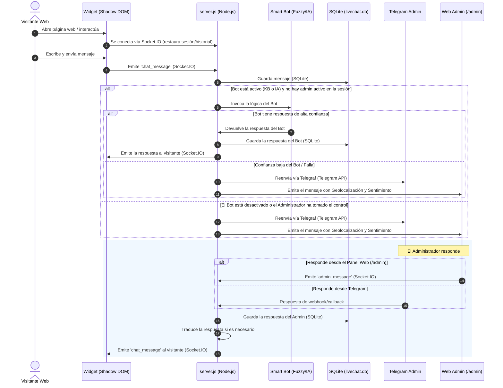

# LiveChat Pro

> Proyecto educativo: este repositorio está pensado para aprendizaje, experimentación y referencia técnica. Revisa, endurece y adapta la configuración antes de usarlo en producción.

[Español](README_ES.md) | [English](README.md) | [Português](README_BR.md)

Chat en vivo auto-hospedado con widget embebible, integración con Telegram, panel web de administración único, persistencia SQLite y despliegue recomendado con Docker.

## Qué Hace

- Inserta un chat en cualquier web con un solo `<script>`.
- Mantiene una sesión por visitante con historial persistente.
- Envía mensajes del visitante a Telegram y al panel web `/admin`.
- Permite responder desde Telegram o desde el panel admin.
- Muestra IP, geolocalización, página actual, idioma, user-agent y métricas generales.
- Permite limpiar, bloquear, banear o eliminar chats individuales.
- Traduce mensajes entre el idioma del visitante y el idioma configurado para el admin.

## Requisitos

Para desarrollo local:

- Node.js del sistema `>=24`
- npm
- Acceso a internet para instalar dependencias y usar traducción automática

Para VPS público:

- Linux con usuario que tenga `sudo`
- Node.js del sistema `>=24`
- Docker Engine + plugin Docker Compose
- Puerto `8080/tcp` abierto para LiveChat Pro
- Bot de Telegram creado con [@BotFather](https://t.me/BotFather)
- Tu ID numérico de Telegram

Las dependencias del sistema se validan e instalan de manera automática usando los scripts de instalación nativos:
- **Linux (Basado en Docker):** `Install.sh` verifica/instala Node.js >= 24, npm y Docker.
- **Windows (Basado en Node):** `Install.ps1` verifica/instala Node.js >= 24, npm y ejecuta `npm install`.

## Instalación con un Comando

Para configurar rápidamente el entorno, verificar dependencias, clonar el repositorio del proyecto y ejecutar el asistente interactivo de configuración, ejecuta el comando correspondiente a tu sistema operativo:

### Linux
```bash
curl -fsSL https://raw.githubusercontent.com/wilkinbarban/LiveChat-Pro/main/install.sh | bash
```

### Windows (PowerShell Administrador)
Abre PowerShell como Administrador y ejecuta:
```powershell
powershell -NoProfile -ExecutionPolicy Bypass -Command "irm https://raw.githubusercontent.com/wilkinbarban/LiveChat-Pro/main/install.ps1 | iex"
```

---

### Proceso Detallado de Instalación: Qué Hacen Estos Scripts

#### Instalador de Linux (`install.sh`)
Cuando ejecutas el instalador automático en Linux, realiza la siguiente secuencia detallada:
1. **Comprobación de Privilegios**: Verifica que el script se ejecute como root o mediante `sudo`. Los gestores de paquetes del sistema requieren privilegios administrativos.
2. **Identificación de la Distribución**: Detecta la distribución de Linux para invocar el gestor de paquetes correcto (ej. `apt` para Debian/Ubuntu, `yum`/`dnf` para RHEL/CentOS, o `pacman` para Arch).
3. **Verificación e Instalación de Prerrequisitos**:
   - **Git**: Comprueba si `git` está disponible. Si falta, lo instala automáticamente.
   - **Node.js y npm**: Verifica la presencia de Node.js (versión 24 o superior). Si falta o está desactualizado, configura los repositorios de NodeSource o del sistema para instalar el entorno de ejecución correcto junto con `npm`.
   - **Docker y Docker Compose**: Comprueba si el motor de Docker y el plugin de Docker Compose están instalados. Si faltan, los instala, inicia el servicio de Docker y lo configura para que arranque con el sistema.
4. **Comprobación del Directorio del Proyecto**: Verifica si `setup.js` existe en el directorio de trabajo actual. Si no se encuentra, el script clona automáticamente el repositorio desde `https://github.com/wilkinbarban/LiveChat-Pro.git` en una carpeta llamada `LiveChat-Pro` y entra en ella.
5. **Asistente de Configuración Interactivo**: Ejecuta `node setup.js` para solicitarte los parámetros de entorno y generar un archivo `.env` personalizado.
6. **Compilación e Inicio de Contenedores**: Ofrece compilar e iniciar los servicios inmediatamente a través de `docker compose up -d --build`.
7. **Registro de Ejecución**: Redirige la salida de todas las comprobaciones e instalaciones al archivo `install.log` en segundo plano, mostrando un indicador de progreso animado en la terminal.

#### Instalador de Windows (`install.ps1`)
Cuando ejecutas el instalador automático de Windows en PowerShell, realiza los siguientes pasos:
1. **Comprobación de Privilegios de Administrador**: Confirma que la sesión actual de PowerShell tiene permisos de Administrador, necesarios para realizar ajustes a nivel de sistema.
2. **Verificación e Instalación de Dependencias**:
   - **Git**: Inspecciona si Git está instalado. Si falta, utiliza `winget` (Windows Package Manager) para instalarlo, o lo descarga directamente si `winget` no está disponible.
   - **Node.js y npm**: Busca Node.js (versión 24 o superior). Si no lo encuentra, descarga y ejecuta el instalador oficial MSI de forma silenciosa, actualizando las variables de entorno correspondientes.
3. **Comprobación del Directorio del Proyecto**: Busca el archivo `setup.js`. Si no está, utiliza Git para clonar el proyecto desde `https://github.com/wilkinbarban/LiveChat-Pro.git` y accede a la carpeta.
4. **Resolución Directa de Dependencias (npm install)**: Ejecuta `npm install` directamente en el sistema operativo local para instalar las librerías de Node.js necesarias.
5. **Lanzamiento del Asistente**: Ejecuta el asistente interactivo de configuración (`node setup.js`) para definir el token del bot de Telegram, credenciales de administrador y demás preferencias.
6. **Inicio Opcional del Servidor**: Al finalizar la configuración, el script te pregunta si deseas arrancar el servidor de chat directamente usando Node (`node server.js`).
7. **Arquitectura Sin Docker**:
   > [!IMPORTANT]
   > LiveChat Pro en Windows está diseñado para ejecutarse de forma nativa. **No requiere, utiliza ni instala Docker, Docker Desktop ni ningún servicio de contenedores en Windows**. Todo el servidor, la base de datos y las tareas en segundo plano se ejecutan directamente en el sistema Windows local como procesos estándar de Node.js.
8. **Registro de Ejecución**: Toda la salida de la consola del instalador se registra en `install.log` en segundo plano para facilitar la resolución de problemas.

---

## Instalación Recomendada en VPS

Ejecuta el script nativo según tu sistema operativo:
```bash
chmod +x install.sh
./install.sh
```
Al finalizar la preparación de dependencias, se iniciará el asistente interactivo `setup.js`. En él:
1. Elige **Configuración Básica** (para configuración rápida) o **Configuración Completa** (para configurar los 43 parámetros disponibles).
2. Sigue las preguntas para configurar el bot de Telegram, la contraseña del panel de administración, los orígenes, etc.
3. Cuando te pregunte, selecciona **Sí** para compilar y arrancar el servidor usando Docker Compose.

El perfil de despliegue configura:
```env
PORT="3000"
HOST_PORT="8080"
```
Node escucha dentro del contenedor en `3000`, pero Docker publica el proyecto hacia internet en `8080`. Este puerto es la opción recomendada para dejar `80` y `443` libres para tu sitio web público o para un proxy HTTPS.

Si no tienes dominio todavía, `setup.js` detecta la IP pública del VPS y genera un script como:
```html
<script src="http://IP-PUBLICA:8080/widget.js" data-server="http://IP-PUBLICA:8080"></script>
```

Si tienes dominio, escríbelo cuando el asistente pregunte por dominio/orígenes permitidos. Al finalizar, el instalador muestra la URL del demo, panel admin, healthcheck y el `<script>` final para pegar en la web externa.

Si tu usuario no tiene permisos de sudo, entra como root o agrégalo al grupo sudo/wheel antes de ejecutar el instalador.

---

## Instalación Manual (Alternativa)

Si prefieres no utilizar los scripts automáticos, puedes configurar el proyecto manualmente paso a paso:

### Linux (Basado en Docker / Producción)
1. **Instalar Prerrequisitos**: Asegúrate de tener Git, Node.js (>=24), npm, Docker y Docker Compose instalado en tu sistema.
   - Por ejemplo, en Ubuntu/Debian:
     ```bash
     sudo apt update
     sudo apt install -y git nodejs npm docker.io docker-compose-v2
     ```
2. **Clonar el Repositorio**:
   ```bash
   git clone https://github.com/wilkinbarban/LiveChat-Pro.git
   cd LiveChat-Pro
   ```
3. **Instalar Dependencias locales del proyecto**:
   ```bash
   npm install
   ```
4. **Configurar las Variables de Entorno**:
   Ejecuta la herramienta de configuración interactiva en la CLI para responder a las preguntas y generar el archivo `.env`:
   ```bash
   node setup.js
   ```
5. **Iniciar los Servicios de la Aplicación**:
   Compila e inicia los servicios en segundo plano usando Docker Compose:
   ```bash
   docker compose up -d --build
   ```
6. **Verificar el Estado del Servidor**:
   ```bash
   curl http://localhost:8080/health
   ```

### Windows (Basado en Node / Servidor Directo)
1. **Instalar Prerrequisitos**: Descarga e instala Git desde [git-scm.com](https://git-scm.com/) y Node.js (versión 24 o superior) desde [nodejs.org](https://nodejs.org/).
   > [!NOTE]
   > LiveChat Pro en Windows no requiere, utiliza ni instala Docker. Todo se ejecuta de forma nativa directamente sobre tu sistema operativo.
2. **Clonar el Repositorio**:
   Abre PowerShell o el Símbolo del sistema y ejecuta:
   ```powershell
   git clone https://github.com/wilkinbarban/LiveChat-Pro.git
   cd LiveChat-Pro
   ```
3. **Instalar Dependencias**:
   ```powershell
   npm install
   ```
4. **Ejecutar el Asistente de Configuración**:
   ```powershell
   node setup.js
   ```
   Sigue las preguntas del asistente para generar tu archivo `.env`.
5. **Iniciar el Servidor**:
   ```powershell
   node server.js
   ```
   El servidor comenzará a escuchar en el puerto configurado en el archivo `.env` (por defecto es `3000`).

---

## Sin Docker (Desarrollo Local en Linux / PM2)
Si estás ejecutando el proyecto directamente en un host Linux sin Docker:

```bash
npm install
node setup.js
node server.js
```

Con PM2:
```bash
npm install -g pm2
pm2 start server.js --name livechat-pro
pm2 startup
pm2 save
```

## Variables de Entorno

El archivo `.env` lo genera `node setup.js`. También puedes crearlo manualmente.

| Variable | Obligatoria | Descripción |
|---|---:|---|
| `TELEGRAM_TOKEN` | Sí | Token del bot de Telegram |
| `TELEGRAM_ADMIN_ID` | Sí | ID numérico del admin en Telegram |
| `ADMIN_PANEL_PASSWORD` | Sí | Contraseña para `/admin` |
| `ADMIN_LANGUAGE` | No | Idioma del admin: `es`, `en`, `pt`, `fr`, `de`, `it` |
| `PORT` | No | Puerto interno de Node. Defecto: `3000` |
| `HOST_PORT` | No | Puerto publicado por Docker. En VPS público usa `8080` para dejar `80`/`443` libres |
| `ALLOWED_ORIGINS` | No | Orígenes CORS permitidos, separados por coma |
| `ADMIN_SESSION_TTL_HOURS` | No | Duración de sesión admin. Defecto: `12` |
| `COOKIE_SAME_SITE` | No | Política SameSite de cookies admin: `lax`, `strict` o `none`. Defecto: `lax`; `none` requiere HTTPS |
| `LOG_LEVEL` | No | `fatal`, `error`, `warn`, `info`, `debug`, `trace` |
| `DB_PATH` | No | Ruta SQLite. Defecto: `data/livechat.db` |
| `WIDGET_PRIMARY_COLOR` | No | Color principal del widget |
| `WIDGET_BUTTON_STYLE` | No | `floating`, `persistent` o `hidden` |
| `WIDGET_WELCOME_MESSAGE` | No | Mensaje fijo. Vacío activa saludo automático por idioma |
| `WIDGET_API_KEY` | No | Credencial opcional del widget. Si se define, el cliente debe enviarla en `data-api-key` o el servidor rechazará la conexión del chat |
| `FEATURE_TRANSLATION` | No | `true`/`false` |
| `TRANSLATION_PROVIDER` | No | Proveedor de traducción: `google_free`, `google_cloud` o `deepl`. Defecto: `google_free` |
| `TRANSLATION_API_KEY` | No | API key para `google_cloud` o `deepl`; si falta, se usa el fallback gratuito |
| `FEATURE_GEOLOCATION` | No | `true`/`false` |
| `FEATURE_SENTIMENT` | No | `true`/`false` |
| `FEATURE_GHOST_TYPING` | No | `true`/`false` |
| `REDIS_URL` | No | Redis para estado compartido/Socket.IO multi-nodo |
| `REDIS_KEY_PREFIX` | No | Prefijo de claves Redis. Defecto: `lcp` |
| `RATE_LIMIT_WINDOW_MINUTES` | No | Ventana de rate limit. Defecto: `15` |
| `RATE_LIMIT_PUBLIC_MAX` | No | Máximo para rutas públicas como `widget.js` y `/config-public`. Defecto: `300` |
| `RATE_LIMIT_ADMIN_MAX` | No | Máximo para admin no autenticado. Admin autenticado queda excluido. Defecto: `2000` |
| `RATE_LIMIT_LOGIN_MAX` | No | Máximo de intentos a `/api/admin/login`. Defecto: `20` |
| `TRUST_PROXY_HOPS` | No | Saltos de proxy confiables para IP real. Defecto: `1` |

Ejemplo VPS por IP:

```env
PORT="3000"
HOST_PORT="8080"
ALLOWED_ORIGINS="http://185.194.221.162:8080"
```

Ejemplo con dominio HTTPS:

```env
PORT="3000"
HOST_PORT="8080"
ALLOWED_ORIGINS="https://chat.midominio.com"
```

## Widget

Pega el script generado por `setup.js` en la web donde quieres mostrar el chat:

```html
<script src="https://chat.midominio.com/widget.js" data-server="https://chat.midominio.com"></script>
```

Si configuraste `WIDGET_API_KEY`:

```html
<script src="https://chat.midominio.com/widget.js" data-server="https://chat.midominio.com" data-api-key="TU_API_KEY"></script>
```

`WIDGET_API_KEY` sirve para que solo los sitios que tengan tu snippet completo puedan iniciar conexiones del chat. No reemplaza CORS ni convierte el widget en privado, porque cualquier clave puesta en HTML puede verse desde el navegador, pero ayuda a evitar integraciones accidentales o clientes sin la credencial esperada.

Ejemplo de `.env`:

```env
WIDGET_API_KEY="clave-larga-random-para-mi-web"
```

Ejemplo del script en tu sitio:

```html
<script
  src="https://chat.midominio.com/widget.js"
  data-server="https://chat.midominio.com"
  data-api-key="clave-larga-random-para-mi-web">
</script>
```

Si eliges `WIDGET_BUTTON_STYLE="hidden"` o la opción `Oculto, para abrirlo por código` en `setup.js`, el widget se carga pero no muestra el botón flotante. Puedes abrir el chat con tu propio botón:

```html
<script src="https://chat.midominio.com/widget.js" data-server="https://chat.midominio.com"></script>

<button type="button" onclick="document.getElementById('lcp-btn')?.click()">
  Abrir chat
</button>
```

Con `WIDGET_API_KEY` y botón oculto:

```html
<script
  src="https://chat.midominio.com/widget.js"
  data-server="https://chat.midominio.com"
  data-api-key="clave-larga-random-para-mi-web">
</script>

<button type="button" onclick="document.getElementById('lcp-btn')?.click()">
  Abrir chat
</button>
```

El widget guarda la sesión del visitante con `localStorage` y cookie `lchat_sid`.

### Comportamiento responsive del widget

El widget detecta automáticamente el modo móvil del sitio donde está instalado con `window.matchMedia`. Por defecto entra en modo móvil cuando el viewport mide `768px` o menos. Si el navegador no soporta `matchMedia`, usa `window.innerWidth` como fallback.

Cuando cambia el tamaño de pantalla o el usuario rota el dispositivo, el widget actualiza su clase interna `lcp-mobile` sin recargar la página. En escritorio se mantiene como ventana flotante; en móvil deja de ser flotante y se convierte en una barra inferior fija tipo menú.

Al abrirlo en móvil, el chat usa una vista controlada de pantalla completa: header fijo, mensajes con scroll interno e input fijo abajo. Esto evita que la ventana del chat mida más que la resolución visible del sitio.

Con `data-theme="auto"`, el widget toma la fuente, color de texto, fondo base y acento del sitio donde se inserta. Esto evita que el chat desplegado se vea como una pieza visual ajena en el modo celular.

Al abrir el chat en móvil, el panel se limita con `visualViewport` cuando el navegador lo soporta. Esto mantiene el área de mensajes e input dentro de la pantalla visible, incluso cuando aparece el teclado del celular. El CSS interno del widget se encapsula con Shadow DOM para reducir conflictos con estilos del sitio.

Puedes personalizar el comportamiento por sitio con atributos del script:

```html
<script
  src="https://chat.midominio.com/widget.js"
  data-server="https://chat.midominio.com"
  data-mobile-breakpoint="820"
  data-mobile-mode="dock"
  data-mobile-width="100"
  data-mobile-focused-width="94"
  data-mobile-focused-height="76"
  data-theme="auto"
  data-position="bottom-right">
</script>
```

Opciones disponibles:

- `data-mobile-breakpoint`: ancho máximo considerado móvil. Defecto: `768`.
- `data-mobile-mode`: `dock`, `compact`, `bottom-sheet` o `fullscreen`. Defecto: `dock`.
- `data-mobile-width`: ancho del panel abierto en móvil, en porcentaje del viewport. Defecto: `100`. Rango permitido: `70` a `100`.
- `data-mobile-focused-width`: ancho del panel móvil cuando el campo de texto tiene foco y aparece el teclado, en porcentaje del viewport. Defecto: `94`. Rango permitido: `70` a `100`.
- `data-mobile-focused-height`: alto máximo del panel móvil cuando el campo de texto tiene foco y aparece el teclado, en porcentaje del viewport visible. Defecto: `76`. Rango permitido: `50` a `95`.
- `data-theme`: `auto` hereda fuente, texto, fondo y tono visual del sitio; `classic` usa el diseño de marca del widget.
- `data-position`: `bottom-right` o `bottom-left`.

Para un sitio móvil donde el teclado tapa demasiado el historial, puedes reducir un poco el panel enfocado:

```html
<script
  src="https://chat.midominio.com/widget.js"
  data-server="https://chat.midominio.com"
  data-mobile-mode="dock"
  data-mobile-focused-width="92"
  data-mobile-focused-height="68">
</script>
```

También puedes definirlas antes del script con `window.LiveChatConfig`:

```html
<script>
  window.LiveChatConfig = {
    mobileBreakpoint: 820,
    mobileMode: 'dock',
    mobileWidth: 100,
    mobileFocusedWidth: 92,
    mobileFocusedHeight: 68,
    theme: 'auto',
    position: 'bottom-left'
  };
</script>
<script src="https://chat.midominio.com/widget.js" data-server="https://chat.midominio.com"></script>
```

## Panel Admin

Accede a:

```text
http://TU_IP:8080/admin
https://chat.midominio.com/admin
```

El panel está diseñado para uso de un único admin del sistema, sin flujos de personal externo.

Funciones:

- Ver todos los chats por usuario.
- Buscar por nombre, ID, IP, país o página.
- Ver geolocalización, IP, ISP, idioma, página actual y user-agent.
- Ver métricas generales de usuarios, conectados, desconectados, mensajes y bloqueos.
- Responder al usuario.
- Limpiar chat individual.
- Bloquear o banear usuario.
- Eliminar sesión y mensajes.

### API Admin Actual

| Método | Ruta | Descripción |
|---|---|---|
| `GET` | `/api/admin/me` | Estado de autenticación |
| `POST` | `/api/admin/login` | Iniciar sesión |
| `POST` | `/api/admin/logout` | Cerrar sesión |
| `GET` | `/api/admin/sessions` | Listar sesiones |
| `GET` | `/api/admin/sessions/:id` | Detalle de sesión y mensajes |
| `POST` | `/api/admin/sessions/:id/message` | Responder al usuario |
| `POST` | `/api/admin/sessions/:id/typing` | Indicador de escritura admin |
| `POST` | `/api/admin/sessions/:id/read` | Marcar lectura |
| `GET` | `/api/admin/metrics/general` | Métricas generales |
| `POST` | `/api/admin/sessions/:id/clear` | Limpiar chat |
| `POST` | `/api/admin/sessions/:id/block` | Bloquear usuario |
| `POST` | `/api/admin/sessions/:id/ban` | Banear usuario |
| `DELETE` | `/api/admin/sessions/:id` | Eliminar sesión |

Las acciones mutantes usan protección CSRF con cookie `lcp_csrf` y header `x-csrf-token`.

El rate limit está separado por zona:

- Login admin: protegido por `RATE_LIMIT_LOGIN_MAX`.
- Rutas públicas del widget: protegidas por `RATE_LIMIT_PUBLIC_MAX`.
- API admin no autenticada: protegida por `RATE_LIMIT_ADMIN_MAX`.
- Admin autenticado: no consume el cupo del limitador admin.

## Telegram

| Comando | Descripción |
|---|---|
| `/usuarios` | Lista usuarios activos |
| `/ban [id]` | Banea por prefijo de `sessionId` |
| `/info [id]` | Muestra IP, ubicación, user-agent y página |
| `/clean` | Elimina sesiones inactivas sin mensajes |

Para responder desde Telegram, responde directamente al mensaje que llegó para esa sesión.

## Traducción e Idiomas

El widget detecta el idioma del navegador del visitante y lo guarda en la sesión.

Saludos automáticos soportados:

| Idioma | Código |
|---|---|
| Español | `es` |
| Inglés | `en` |
| Portugués | `pt` |

El admin puede trabajar en:

```text
es, en, pt, fr, de, it
```

Flujo:

1. Visitante escribe en su idioma.
2. El admin ve el mensaje traducido a `ADMIN_LANGUAGE`.
3. El admin responde.
4. La respuesta se traduce al idioma de la sesión.
5. El visitante recibe la respuesta en su idioma.

La traducción depende de `FEATURE_TRANSLATION="true"`.

## Arquitectura

```text
Visitante web
  │
  │ Socket.IO
  ▼
server.js
  ├─ Express REST
  ├─ Socket.IO widget
  ├─ Socket.IO /admin
  ├─ Telegraf Telegram
  └─ db.js SQLite
        ▼
   /app/data/livechat.db
   ▲ dentro de Docker: volumen livechat_data montado en /app/data
```

En ejecución local sin Docker, la ruta por defecto sí es `data/livechat.db` dentro del directorio del proyecto.

## Cómo Funciona y Flujo de Trabajo Detallado

LiveChat Pro coordina un canal de comunicación optimizado en tiempo real a través de múltiples capas en el backend y el frontend. A continuación se presenta un desglose exhaustivo de su flujo de trabajo:



### Fases de la Arquitectura en Detalle

1. **Aislamiento en el Frontend y Diseño Responsivo**:
   - El navegador del visitante carga la web que tiene integrado el script del chat. Se descarga `/widget.js`, el cual inicializa y renderiza toda la interfaz de usuario dentro de un **Shadow DOM**. Esto asegura un aislamiento completo: los estilos CSS del widget no chocan ni alteran las hojas de estilo del sitio web principal (como Bootstrap o Tailwind), ni viceversa.
   - El widget monitorea constantemente los cambios en el tamaño de la pantalla mediante `window.matchMedia`. Si la pantalla mide `768px` o menos, cambia automáticamente de una burbuja flotante a un panel inferior fijo adaptado para pantallas móviles.
   - En móviles, utiliza la API `visualViewport` para calcular la altura real visible del navegador cuando aparece el teclado virtual en pantalla. Esto evita que el teclado oculte el campo de texto de entrada de mensajes.

2. **Ciclo de Vida de la Sesión, Conexión y Base de Datos SQLite**:
   - El widget mantiene una conexión persistente mediante **Socket.IO** con el servidor backend (`server.js`).
   - Al conectarse, el widget envía el identificador de sesión del visitante (`lchat_sid`) almacenado en `localStorage` o cookies. El servidor busca dicho ID en la base de datos SQLite (`livechat.db`) para restaurar la sesión y el historial completo. Si no existe, crea una fila nueva con metadatos iniciales del visitante.
   - En caso de desconexión por problemas de red, Socket.IO reintenta la conexión automáticamente y descarga los mensajes pendientes.

3. **Intercepción Inteligente y Capa del Bot (Antes del Escalado)**:
   - Al recibir un mensaje del visitante, el servidor evalúa si el bot está habilitado. Si el administrador no ha intervenido directamente en esa sesión (lo cual silencia al bot) y `BOT_MODE` está configurado:
     - **Modo Knowledge-Base**: Utiliza un stemmer lingüístico local y calcula el coeficiente de similitud de Dice contra las entradas de `data/knowledge-base.json`. Si supera el umbral de `BOT_CONFIDENCE_THRESHOLD`, el bot responde directamente de forma instantánea.
     - **Modo Inteligencia Artificial (IA)**: El backend compone un prompt con las instrucciones del sistema (`BOT_SYSTEM_PROMPT`), inyecta los últimos mensajes de contexto (`BOT_CONTEXT_MESSAGES`) y hace una petición a la API del proveedor de IA configurado (OpenRouter, Gemini, OpenAI, etc.).
     - Si el bot maneja con éxito la respuesta y `BOT_NOTIFY_ADMIN` es `false`, la sesión no se escala a los canales del administrador. De lo contrario, se escala de inmediato.

4. **Geolocalización por IP, Stemming y Análisis de Sentimiento**:
   - Al procesarse el mensaje, se ejecutan flujos de análisis adicionales:
     - **Geolocalización**: El servidor analiza la IP pública real del visitante mediante `geoip-lite` para determinar su país, región e ISP.
     - **Análisis de Sentimiento**: Un procesador local analiza las palabras del mensaje. Si detecta que la puntuación de sentimiento es negativa (indicando molestia o queja del usuario), el chat se resalta en el panel del administrador y se eleva su prioridad.
     - **Traducción Automática**: Si el idioma detectado en el navegador del visitante difiere del `ADMIN_LANGUAGE` configurado (y `FEATURE_TRANSLATION` está activo), el servidor traduce el mensaje utilizando el proveedor activo (Google Translate gratuito, Google Cloud Translate o DeepL) antes de enviarlo al administrador.

5. **Doble Notificación a Administradores y Sincronización de Escritura**:
   - Los chats escalados se notifican en tiempo real al panel de control `/admin` vía Socket.IO (mostrando métricas, IP, sentimiento e idioma) y al bot de Telegram del administrador usando el framework **Telegraf**. La notificación de Telegram incluye enlaces rápidos para realizar acciones (como bloquear, limpiar el chat o banear).
   - **Ghost Typing (Escritura fantasma)**: Si `FEATURE_GHOST_TYPING` está activado, cuando el administrador escribe en el panel de control `/admin`, el visitante ve en tiempo real el indicador de que "el administrador está escribiendo...". De la misma forma, el estado de escritura se sincroniza al responder desde Telegram.

6. **Ruta de Respuesta y Traducción Inversa**:
   - El administrador puede responder directamente escribiendo en el panel de administración web o respondiendo al mensaje correspondiente en el chat de Telegram.
   - El backend intercepta la respuesta, la guarda en SQLite y, de ser necesario, la traduce de vuelta al idioma detectado del visitante antes de enviársela mediante Socket.IO.

## Redis Opcional

Docker Compose incluye Redis y configura:

```env
REDIS_URL="redis://redis:6379"
REDIS_KEY_PREFIX="lcp"
```

Redis se usa para presencia, estado compartido y adaptador Socket.IO cuando hay varios nodos.

Para instalación local sin Docker:

```env
REDIS_URL="redis://127.0.0.1:6379"
```

Si `/health` devuelve `stateMode: "redis"`, Redis está activo.

## Nginx y HTTPS

Para dominio real con HTTPS puedes usar el archivo incluido:

```bash
sudo cp nginx/livechat.conf /etc/nginx/sites-available/livechat
sudo ln -s /etc/nginx/sites-available/livechat /etc/nginx/sites-enabled/
sudo nginx -t
sudo systemctl reload nginx
```

Certificado con Certbot:

```bash
sudo certbot --nginx -d chat.midominio.com
```

Luego ajusta:

```env
ALLOWED_ORIGINS="https://chat.midominio.com"
```

Las cookies admin se marcan como `Secure` cuando la petición llega por HTTPS o por proxy con `X-Forwarded-Proto: https`. En desarrollo por IP HTTP funcionan sin `Secure`.

La geolocalización del admin depende de que Node reciba la IP pública real del visitante. La plantilla `nginx/livechat.conf` ya envía `X-Real-IP` y `X-Forwarded-For`; si el panel muestra IPs `127.x`, `10.x`, `172.16-31.x` o `192.168.x`, el servidor está viendo una IP privada de Docker/proxy y la ubicación aparecerá como desconocida. En ese caso usa Nginx/HTTPS delante del contenedor o verifica que el proxy conserve esas cabeceras.

## Archivos Principales

```text
server.js           Servidor Express, Socket.IO y Telegram
widget.js           Widget embebible
Install.sh          Instalador nativo de dependencias para Linux
Install.ps1         Instalador nativo de dependencias para Windows
setup.js            Asistente interactivo de configuración de entorno (.env)
db.js               Persistencia SQLite
cluster-state.js    Estado compartido opcional con Redis
public/index.html   Demo del widget
public/admin.html   Panel admin único
docker-compose.yml  App + Redis + volúmenes
Dockerfile          Imagen de producción
nginx/livechat.conf Proxy inverso HTTPS
tests/              Pruebas automáticas
data/livechat.db    Base SQLite en ejecución local sin Docker
```


## Pruebas

```bash
npm test
npm run test:db
npm run test:api
```

Las pruebas usan `node:test` y SQLite en memoria para no tocar datos reales.

## Estado del Sistema

```text
/health
/health?format=json
```

Muestra estado general, sesiones en memoria, modo de estado (`memory` o `redis`), Telegram, uptime, configuración pública del widget y funciones activas.

## Seguridad

- Usa contraseña fuerte para `ADMIN_PANEL_PASSWORD`.
- En producción con dominio, usa HTTPS.
- Restringe `ALLOWED_ORIGINS` al dominio real.
- Abre solo los puertos necesarios en el VPS.
- Si usas `WIDGET_API_KEY`, el widget debe incluir `data-api-key`.

## Funcionalidades Implementadas

- Chat en tiempo real con Socket.IO.
- Widget embebible.
- Panel admin único.
- Integración Telegram.
- Persistencia SQLite.
- Métricas generales.
- Limpieza, bloqueo, baneo y eliminación por chat.
- Traducción automática.
- Geolocalización por IP.
- Read receipts.
- Ghost typing hacia Telegram.
- Rate limiting HTTP y por socket.
- Helmet y CSRF en acciones admin.
- Docker Compose con Redis.
- Setup interactivo para VPS público o desarrollo local.
- Suite de tests automatizada.

## Documentación del Proyecto

- [README en inglés](README.md)
- [README en portugués](README_BR.md)
- [Índice de documentación](docs/README.md)
- [Guía de contribución](CONTRIBUTING.md)
- [Política de seguridad](SECURITY.md)
- [Licencia GPL](LICENSE)

## Novedades en v1.0.2

- Se agregó `kb-trainer/`, una CLI independiente para crear `data/knowledge-base.json` desde URLs y archivos locales.
- El trainer ahora soporta 10 proveedores de IA más `none`: OpenRouter, Groq, Gemini, OpenAI, xAI, Anthropic, Mistral, Cohere, Ollama y endpoints custom compatibles con OpenAI.
- Smart Bot mejora con coeficiente Dice, stemmer en español, desambiguación y protección de nombres propios en traducciones.
- `setup.js` puede ejecutar kb-trainer al configurar el modo `knowledge-base`.
- `.env.example` quedó completo en inglés y documenta cada variable.

## 🤖 Smart Bot / AI

LiveChat Pro incluye un bot inteligente opcional que responde automáticamente antes de escalar a un humano.

| `BOT_MODE` | Comportamiento |
|---|---|
| `disabled` | Sin bot: todos los mensajes van a Telegram/admin (por defecto). |
| `knowledge-base` | Responde desde `data/knowledge-base.json` usando búsqueda difusa y umbral de confianza. |
| `ai` | Usa respuestas con IA compatible con OpenAI y contexto reciente de la conversación. |

**Variables:** `BOT_MODE`, `OPENAI_API_KEY`, `OPENAI_MODEL`, `OPENAI_MAX_TOKENS`, `BOT_SYSTEM_PROMPT`, `BOT_CONFIDENCE_THRESHOLD`, `BOT_CONTEXT_MESSAGES`, `BOT_NOTIFY_ADMIN`.

`BOT_CONFIDENCE_THRESHOLD` define qué tan seguro debe estar el bot de knowledge-base antes de responder. Valores altos escalan más; valores bajos responden más agresivamente. Si no está seguro, pasa a Telegram/admin. Si el admin responde, el bot se silencia en esa sesión. Comandos: `/bot on [sessionId]` y `/bot off [sessionId]`.

## 🤖 Entrenamiento de Knowledge Base (`kb-trainer/`)

`kb-trainer` crea o actualiza `data/knowledge-base.json` desde URLs y archivos locales. Puede funcionar sin IA o enriquecer las entradas con proveedores de IA.

| Proveedor | Modelo default | Free tier |
|---|---|---|
| `none` | — | ✅ Sin API key |
| `openrouter` | `meta-llama/llama-3.1-8b-instruct:free` | ✅ Modelos gratis |
| `groq` | `llama-3.1-8b-instant` | ✅ Free tier |
| `gemini` | `gemini-1.5-flash` | ✅ Cuota gratis |
| `openai` | `gpt-4o-mini` | — |
| `xai` | `grok-beta` | — |
| `anthropic` | `claude-3-haiku-20240307` | — |
| `mistral` | `mistral-small-latest` | — |
| `cohere` | `command-r` | — |
| `ollama` | `llama3` | ✅ Local, sin key |
| `custom` | configurable | ✅ Cualquier endpoint compatible con OpenAI |

**Free tier highlights:** `none` funciona sin key, OpenRouter ofrece modelos gratis, Groq tiene tier gratuito rápido, Gemini incluye cuota gratis y Ollama corre localmente.

**Ejemplos de uso:**

```bash
node kb-trainer/index.js --interactive
node kb-trainer/index.js --provider none --urls "https://your-site.com/faq,docs/manual.md"
node kb-trainer/index.js --provider openrouter --key sk-or-xxx --urls "https://your-site.com"
node kb-trainer/index.js --provider groq --key gsk_xxx --model llama-3.1-8b-instant --urls "https://site.com"
node kb-trainer/index.js --provider gemini --key AIza_xxx --model gemini-1.5-flash --urls "docs/faq.md"
node kb-trainer/index.js --provider openai --key sk-xxx --model gpt-4o-mini --urls "docs/faq.md" --mode replace
node kb-trainer/index.js --provider xai --key xai-xxx --model grok-beta --urls "docs/faq.md"
node kb-trainer/index.js --provider anthropic --key sk-ant-xxx --model claude-3-haiku-20240307 --urls "docs/faq.md"
node kb-trainer/index.js --provider mistral --key xxx --model mistral-small-latest --urls "docs/faq.md"
node kb-trainer/index.js --provider cohere --key xxx --model command-r --urls "docs/faq.md"
node kb-trainer/index.js --provider ollama --base-url http://localhost:11434/v1 --model llama3 --urls "docs/manual.md"
node kb-trainer/index.js --provider custom --base-url http://localhost:1234/v1 --model local-model --urls "README.md"
```

Usa `--interactive` para un flujo guiado como el que lanza `setup.js`. Pregunta proveedor, key, modelo, idioma, modo de escritura, archivo de salida, fuentes y preferencia de dry-run.

**Opciones CLI:** `--interactive`, `--provider`, `--key`, `--model`, `--base-url`, `--urls`, `--mode append|replace`, `--output`, `--lang`, `--dry-run`, `--help`.

El JSON conserva la estructura: `version`, `language`, `fallback` y `entries` con `id`, `keywords`, `question`, `answer`, `source` y `category`. LiveChat Pro lo usa con `BOT_MODE=knowledge-base` para responder antes de escalar al administrador.
