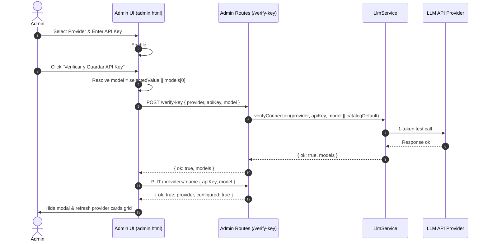
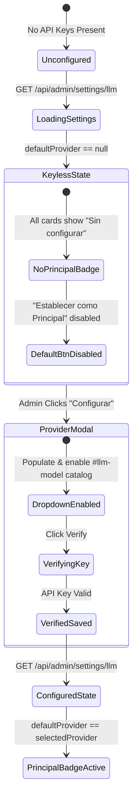

# Design: AI DeepSeek Key Verification & Default Provider Fixes

## Technical Approach

Update the LLM admin subsystem across backend (`src/routes/admin.js`) and frontend (`public/admin.html`) to dynamically derive default models from `llmService.getProviderModels(provider)` instead of hardcoding `gpt-4o-mini`. Additionally, update `GET /api/admin/settings/llm` to return `defaultProvider: null` when no API keys are configured, preventing false `Proveedor Principal` badges in the dashboard. Enable the modal `#llm-model` dropdown prior to key verification whenever catalog models are available, and pass the resolved default model in verification payloads if none is selected.

## Architecture Decisions

### ADR-1: Provider-Specific Default Model Resolution in `src/routes/admin.js`

**Choice**: Inspect `llmService.getProviderModels(normProvider)[0]` to resolve omitted or empty model values across `/verify-key`, `handlePutLlmProvider`, and `handleGetLlmSettings`.
**Alternatives considered**: Hardcode provider fallbacks in route switch cases, or require the frontend to always supply a model string.
**Rationale**: Centralizing provider model defaults in `llmService` avoids duplicate mapping logic across routes and ensures non-OpenAI verification requests (DeepSeek, Kimi, Qwen, OpenRouter) receive valid catalog models instead of failing on `gpt-4o-mini`.

| Option | Tradeoff | Decision |
|--------|----------|----------|
| `llmService.getProviderModels(provider)[0]` | Dynamic lookup based on service registry; empty array fallback if provider unknown. | **Selected** — Maintains single source of truth for model catalogs. |
| Hardcoded fallback `gpt-4o-mini` | Simple, but fails for non-OpenAI providers (e.g. DeepSeek returning unsupported model error). | Rejected. |

### ADR-2: Keyless Default Provider Behavior

**Choice**: In `handleGetLlmSettings`, return `defaultProvider: null` when `llm.default_provider` is not set AND no provider in `providers` has `configured: true`.
**Alternatives considered**: Fall back to `'openai'` unconditionally.
**Rationale**: Setting `defaultProvider: null` correctly reflects an unconfigured state, hiding the `Proveedor Principal` badge until an admin configures a provider.

| Option | Tradeoff | Decision |
|--------|----------|----------|
| Return `null` when zero configured providers | Header & cards show no active default until explicit key setup. | **Selected** — Prevents misleading default active badge on fresh installations. |
| Always default to `'openai'` | Simple fallback, but displays active badge even with missing key. | Rejected. |

### ADR-3: Pre-Verification Model Dropdown Enablement in Modal

**Choice**: In `updateProviderFields(provider)` within `public/admin.html`, populate `#llm-model` options from `pInfo.models` and set `llmModelInput.disabled = (models.length === 0)`.
**Alternatives considered**: Keep dropdown disabled until `/verify-key` returns HTTP 200.
**Rationale**: Enables admins to view and pre-select a target model prior to verification, ensuring `btnVerifyLlm` captures the selected model or falls back to the catalog default.

| Option | Tradeoff | Decision |
|--------|----------|----------|
| Enable dropdown when `models.length > 0` | Allows model selection before clicking verify key. | **Selected** — Delivers responsive UI and accurate verification payloads. |
| Keep dropdown disabled until verified | Requires successful key verification before model can be seen/selected. | Rejected. |

## Data Flow & UI State Diagrams

### Key Verification & Save Flow



### Dashboard UI State Update



## File Changes

| File | Action | Description |
|------|--------|-------------|
| `src/routes/admin.js` | Modify | Update `handleGetLlmSettings` to return `defaultProvider: null` when keyless. Fall back missing `model` parameters in `/verify-key` and `handlePutLlmProvider` to `llmService.getProviderModels(provider)[0]`. |
| `public/admin.html` | Modify | Update `updateProviderFields` to enable `#llm-model` if models exist. Update `btnVerifyLlm` listener to fallback empty model selection to catalog default, and update summary header rendering for `defaultProvider === null`. |

## Interfaces / Contracts

```typescript
// GET /api/admin/settings/llm response payload
interface LlmSettingsResponse {
  ok: boolean;
  enabled: boolean;
  defaultProvider: string | null; // Null when no provider is configured
  providers: Record<string, {
    configured: boolean;
    maskedKey: string;
    model: string; // Provider-specific default model when unconfigured
    models: string[]; // Supported model catalog
  }>;
}

// POST /api/admin/settings/llm/verify-key request body
interface VerifyKeyRequest {
  provider: string;
  apiKey?: string;
  model?: string; // Optional: resolves to getProviderModels(provider)[0] if omitted/blank
}
```

## Testing Strategy

| Layer | What to Test | Approach |
|-------|-------------|----------|
| Unit | Backend default model resolution & keyless detection | Integration/Unit tests for `handleGetLlmSettings`, `/verify-key`, and `handlePutLlmProvider` verifying `defaultProvider: null` when keyless, and dynamic catalog defaults for DeepSeek/Kimi/Qwen/OpenRouter/Anthropic/OpenAI. |
| Integration / E2E | Frontend modal model dropdown enablement & verification payload | Test `admin.html` script handling for keyless responses, pre-verification dropdown enablement, and empty model fallback in `btnVerifyLlm`. |

## Threat Matrix

N/A — no routing, shell, subprocess, VCS/PR automation, executable-file classification, or process-integration boundary.

## Migration / Rollout

No migration required. Existing saved configurations in `settingsStore` remain valid; only default fallbacks for unconfigured/blank states are updated.
