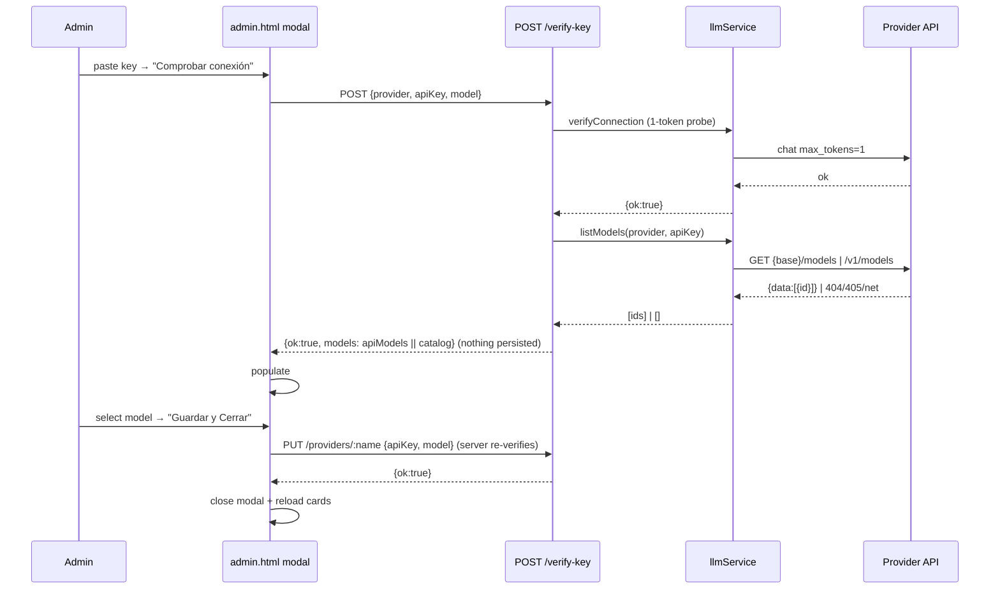
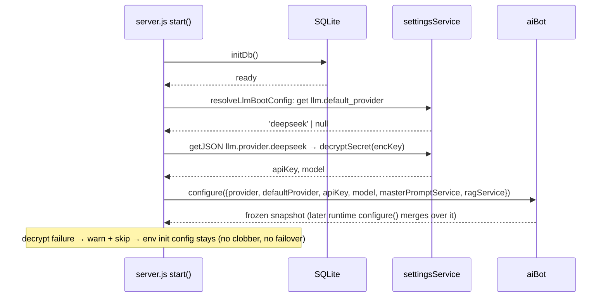
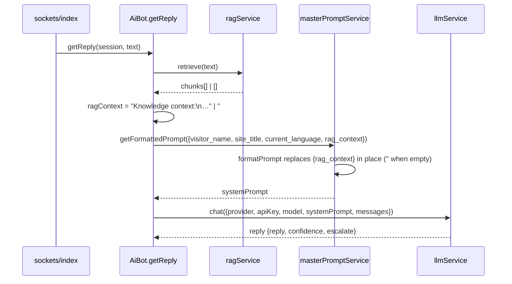

# Design: AI Model Flow (ai-model-flow)

## Context

Verified against current code:
- `verify-key` (admin.js L354-379) returns `verifyRes.models` = static `PROVIDER_MODELS` catalog only. `verifyConnection` (llm/index.js L136-157) runs the 1-token probe and returns catalog models on success — llm-adapters.test.js L175-178 pins that shape, so it must NOT change.
- Admin modal (admin.html L218-249) has ONE combined handler (L1048-1108) on `#btn-verify-llm` ("Verificar y Guardar API Key") that verifies → saves → closes. `#btn-modal-save-model` (L983) already does model-only PUT.
- `aiBot.init()` (server.js L87) is env-only; `settingsService` (L439) exists at module scope but nothing reads `llm.*` at boot. `aiBot` never receives `ragService` anywhere; `masterPromptService` only on prompt-save (admin.js L526).
- `getReply` (ai-bot.js L224-228) fetches RAG **after** `getFormattedPrompt` and appends it — `{rag_context}` inside the prompt template is never substituted. `formatPrompt` (master-prompt.js L139/L145) already supports `rag_context` (covered by master-prompt.test.js L55-64).

## Goals

1. `listModels()` on both adapters; verify-key returns API-verified models, catalog as fallback; `{ok, models}` contract preserved.
2. Two-step modal: "Comprobar conexión" (verify+list, no persist) → "Guardar y Cerrar" (explicit save+close). i18n ×5 (es/en/pt/fr/de, fr uses U+2019).
3. Boot rehydration in `start()` after `initDb`: provider + decrypted key + model + masterPrompt/rag wiring → `aiBot.configure`.
4. `{rag_context}` substituted inside the formatted prompt, never appended.

## Non-goals

Runtime provider failover; multi-default; persisting fetched model lists; provider removal UI; catalog removal; RAG/Chat behavior beyond the placeholder fix.

## Technical Approach

Mirrors the proven `resolveTelegramToken` pattern (bot.js L230-248): settings-backed (decrypted) wins over env; decrypt failure → warn + env fallback; boot never hard-fails. All four work items are additive and individually reversible.

## Architecture Decisions

### ADR 1 — listModels adapter contract + fallback per provider type
**Choice**: Each adapter exports a pure `listModels`-style function returning `Promise<string[]>` (empty array on ANY failure): `listOpenAiCompatibleModels({provider, apiKey, baseURL, fetchImpl})` → `GET {base}/models` → `data[].id`; `listAnthropicModels({apiKey, fetchImpl})` → `GET https://api.anthropic.com/v1/models` with `x-api-key` + `anthropic-version` headers. `LlmService.listModels(provider, apiKey, {fetchImpl, baseURL})` dispatches by provider (anthropic vs OpenAI-compatible). `verifyConnection` stays unchanged (catalog models in its success payload).
**Alternatives**: listModels throwing on error (rejected — forces route try/catch everywhere, noisier); merged into `verifyConnection` (rejected — breaks llm-adapters.test.js L175-178 and couples probe+listing).
**Rationale**: Empty-array-on-failure keeps the route fallback one line (`apiModels.length ? apiModels : catalogModels`), keeps `fetchImpl` DI-testable, and preserves the pinned `verifyConnection` contract.

### ADR 2 — OpenRouter cap/order in UI (~50)
**Choice**: Server returns the full API list; the UI sorts (locale-aware) and slices to 50 when `provider === 'openrouter'` in `populateModelDropdown`.
**Alternatives**: cap server-side in `listModels` (rejected — API contract should stay lossless; GET settings may later want full lists); no cap (rejected — spec mandates it).
**Rationale**: Spec wording is "The admin UI MUST order … and MUST cap" — UI-side is the literal requirement and keeps `{ok, models}` complete.

### ADR 3 — verify-key keeps `{ok, models}` with API models primary
**Choice**: Route flow: `verifyConnection` probe (key validity, unchanged) → on ok call `llmService.listModels` → `models = apiModels.length ? apiModels : catalogModels` → `res.json({ok:true, models})`. 404/405/network inside adapters yields `[]` → catalog fallback (spec "Model-listing API down falls back to static catalog").
**Alternatives**: separate `/models` route (rejected — extra surface, breaks contract, per proposal).
**Rationale**: Same wire contract, upgraded semantics; existing 401/403 tests (admin-llm-routes.test.js L175-190) untouched.

### ADR 4 — Two-step modal state machine
**Choice**: Three buttons in `#ai-modal-overlay`:
- `#btn-verify-llm` → "Comprobar conexión" (`ai.modal.verify_connection`): POST `/verify-key` {provider, apiKey?, model}; on ok populate `#llm-model` with returned models, enable it, set session flag `modalVerified = true`; **never persists, never closes**.
- `#btn-modal-save-model` → "Guardar Modelo" (existing `handleSaveModel`): model-only PUT, no re-verify (spec scenario "Model update without key re-verification").
- NEW `#btn-modal-save-close` → "Guardar y Cerrar" (`ai.modal.save_and_close`): PUT `/providers/:name` {apiKey?, model}, then close + `loadLlmSettings()`.

**Gating**: "Guardar y Cerrar" enabled when `modalVerified === true` OR (provider already configured AND api-key field holds masked value — model-only update). `modalVerified` resets on `openProviderModal` and on API-key input change. `#llm-model` enabled only when models present. Server remains the backstop: `PUT /providers/:name` re-runs `verifyConnection` whenever a plain apiKey is sent (admin.js L396-400), so an unverified key can never activate.
**Alternatives**: keep combined verify+save (rejected — spec mandates two explicit steps); ungate save (rejected — violates "A key that fails verification MUST NOT become active" in spirit, though server still guards).
**Rationale**: Verify-only is stateless; explicit save is auditable; double enforcement (UI gate + server probe) satisfies both spec and security.

### ADR 5 — Boot rehydration placement, no-clobber, decrypt failure
**Choice**: New exported helper `resolveLlmBootConfig({settingsService, logger})` in ai-bot.js (consumer-side, mirrors resolveTelegramToken in bot.js). In `start()` **immediately after `await initDb()`** (server.js L527) and before the Telegram IIFE: read `llm.default_provider` → `llm.provider.{default}` → `decryptSecret(encKey)` → `model` → optionally `ai.enabled` → `aiBot.configure({provider, defaultProvider, apiKey, model, masterPromptService, ragService, enabled?})`. Runs once per boot; runtime PUT/toggle handlers configure later, and `configure`'s merge means runtime wins (no clobber). Decrypt throw → `logger.warn` + skip → env init config stays.
**Alternatives**: inline in server.js (rejected — untestable); in `aiBot.init` (rejected — init is sync/module-time, DB not ready); rehydrate on every admin GET (rejected — clobbers runtime state).
**Rationale**: `start()` is the only boot path; "after initDb" guarantees the settings table is readable; once-only guarantees no clobber.

### ADR 6 — masterPromptService + ragService wired at boot
**Choice**: Create `masterPromptService = createMasterPromptService({settingsService})` and `ragService = createRagService({stmts})` at module scope in server.js (near L439) and pass both into the rehydration `configure` (and reuse the same instances in the admin router deps to avoid duplicate factories). Today `aiBot.config.ragService` is **never** set (getRAGContext always returns null) and `masterPromptService` only lands on prompt-save — so custom master prompts are ignored until an admin re-saves them. Boot wiring fixes both.
**Alternatives**: wire only masterPromptService (rejected — spec scenario "Rehydrated bot fully operational" requires RAG).
**Rationale**: Both factories are cheap and stateless over the same DB; one wiring point at boot makes the reply pipeline fully functional without admin action.

### ADR 7 — `{rag_context}` fed INTO formatPrompt (not appended)
**Choice**: In `getReply`: `ragContext = await getRAGContext(session, text)` FIRST, then `systemPrompt = await getSystemPrompt(session, text, { rag_context: ragContext || '' })`. `getSystemPrompt(session, text, extra = {})` passes `rag_context: extra.rag_context || ''` into `getFormattedPrompt` vars. `formatPrompt` replaces `{rag_context}` in place; empty retrieval → `''` (spec "Empty retrieval yields empty placeholder"). Append block removed.
**Alternatives**: keep appending (rejected — this is the reported bug); pre-replace via string replace in ai-bot (rejected — duplicates formatPrompt logic).
**Rationale**: `formatPrompt` already owns placeholder substitution (tested); passing the var through is the minimal correct change. Boot wiring of `masterPromptService` (ADR 6) is what routes getSystemPrompt into the `getFormattedPrompt` branch.

### ADR 8 — Default-only semantics (no failover)
**Choice**: `resolveLlmBootConfig` reads only `llm.default_provider`; never iterates other providers, never builds a fallback chain.
**Rationale**: Matches spec "Default-only, no auto-failover"; matches current runtime behavior (admin PUT reconfigures only the default).

## Endpoint / API Contract

| Endpoint | Method | Contract (unchanged) | Behavior change |
|---|---|---|---|
| `/api/admin/settings/llm/verify-key` | POST | `{ok:true, models:string[]}` (fail: `{ok:false, error}`) | models = API list via `listModels`; catalog fallback on `[]`; still `requireAdmin`+`requireCsrf` |
| `/api/admin/settings/llm/providers/:name` | PUT | `{ok:true, provider, configured, maskedKey, model}` | unchanged (still re-verifies when apiKey present) |
| `GET /api/admin/settings/llm` | GET | `{ok, enabled, defaultProvider, providers[]}` | unchanged (catalog models still returned) |
| `LlmService.listModels(provider, apiKey, {fetchImpl, baseURL})` | internal | `Promise<string[]>` ([] on 404/405/network/unknown provider) | NEW — adapter dispatch |
| `listOpenAiCompatibleModels` / `listAnthropicModels` | internal | `Promise<string[]>` | NEW — `GET {base}/models` / `GET /v1/models` |

## Sequence Diagrams

### (a) Two-step verify → list → save

### (b) Boot rehydration after initDb

### (c) `{rag_context}` substitution in reply pipeline

## File Changes

| File | Action | Description |
|---|---|---|
| `src/services/llm/openai-compatible.js` | Modify | Add `listOpenAiCompatibleModels({provider, apiKey, baseURL, fetchImpl})` → GET `{base}/models`, Bearer auth, map `data[].id`; `[]` on error. Export it. |
| `src/services/llm/anthropic.js` | Modify | Add `listAnthropicModels({apiKey, fetchImpl})` → GET `https://api.anthropic.com/v1/models` with `x-api-key` + `anthropic-version: 2023-06-01`; `[]` on 404/405/network. Export it. |
| `src/services/llm/index.js` | Modify | Add `listModels(provider, apiKey, opts)` dispatching to the two adapters; `[]` for unknown provider. `PROVIDER_MODELS`, `getProviderModels`, `verifyConnection` untouched. |
| `src/routes/admin.js` | Modify | verify-key (L354-379): after `verifyRes.ok`, `apiModels = await llmService.listModels(...)`; `models = apiModels.length ? apiModels : catalogModels`. |
| `src/services/ai-bot.js` | Modify | `getReply`: RAG first, pass `{rag_context}` into `getSystemPrompt`; remove append. `getSystemPrompt(session, text, extra)` forwards `rag_context`. Add exported `resolveLlmBootConfig({settingsService, logger})`. |
| `server.js` | Modify | Module scope: create `masterPromptService` + `ragService`; `start()` after `initDb()` (L527): `resolveLlmBootConfig` → `aiBot.configure(...)` non-fatal (warn on failure). |
| `public/admin.html` | Modify | Modal: relabel `#btn-verify-llm` → verify-only handler; add `#btn-modal-save-close` "Guardar y Cerrar"; `modalVerified` gate; `populateModelDropdown` sorts + caps 50 for openrouter; new i18n keys ×5 dicts. |
| `tests/llm-adapters.test.js` | Modify | Add: openai-compatible GET `/models` + auth header; anthropic GET `/v1/models` + headers; 404/405/network → `[]`; unknown provider → `[]`. |
| `tests/admin-llm-routes.test.js` | Modify | Mock `llmService.listModels`; verify-key success asserts API models; `listModels→[]` returns catalog; 401/403/unknown-provider untouched. |
| `tests/admin-ai-tab.test.js` | Modify | `ai.modal.verify_save_key` → `ai.modal.verify_connection`; add `save_and_close`, `model_list_title`, `no_models` assertions; assert new button id. |
| `tests/ai-bot.test.js` | Modify | Add: `{rag_context}` substituted via getFormattedPrompt (mock ragService+masterPromptService); empty retrieval → `''`; `resolveLlmBootConfig` precedence + decrypt-failure fallback. |

## Data Flow

    Admin modal ──POST /verify-key──► llmService.verifyConnection ──► provider chat probe (1 token)
         │                                 │
         │◄── {ok, models} (API or catalog) └─► listModels ──► GET {base}/models | /v1/models
         │  (models populate #llm-model)
    "Guardar y Cerrar" ──PUT /providers/:name──► settingsService.setJSON (encKey, model) ──► aiBot.configure

    Boot: initDb ─► resolveLlmBootConfig ─► aiBot.configure({provider, apiKey, model, masterPromptService, ragService})
    Reply: getReply ─► ragService.retrieve ─► masterPromptService.getFormattedPrompt({rag_context}) ─► llmService.chat

## Testing Strategy

| Layer | What to Test | Approach |
|---|---|---|
| Unit | Adapter listModels (URL, headers, id mapping, 404/405/net → `[]`) | `fetchImpl` mocks in llm-adapters.test.js |
| Unit | `resolveLlmBootConfig` precedence / decrypt-failure → null / no default → null | ai-bot.test.js (mirror telegram-bot.test.js resolveTelegramToken) |
| Unit | `getReply` rag_context substitution + empty retrieval | ai-bot.test.js with mock ragService + masterPromptService |
| Integration | verify-key returns API models; fallback to catalog on `[]`; contract `{ok, models}`; 401/403 | admin-llm-routes.test.js (mock llmService) |
| E2E/static | Modal buttons, gating, i18n keys ×5 (fr U+2019), cap-50 logic | admin-ai-tab.test.js HTML/dict assertions |

## Threat Matrix

Routing/shell/VCS applicability: the change modifies the **behavior of an existing admin endpoint** (verify-key response payload) and adds **no new route, no shell command, no subprocess, no VCS/PR automation, no executable-file classification, no process-integration boundary**. Per references/threat-matrix.md every row is N/A:

| Boundary | Applicability | Design response |
|---|---|---|
| Documentation-like paths | N/A — no new executable/doc paths | — |
| Git repository selection | N/A — no VCS/PR automation | — |
| Commit state | N/A — no commit automation | — |
| Push state | N/A — no push automation | — |
| PR commands | N/A — no PR command composition | — |

Auth/CSRF on admin endpoints: `POST /api/admin/settings/llm/verify-key` keeps `requireAdmin` + `requireCsrf` (admin.js L354); existing 401/403 RED tests (admin-llm-routes.test.js L175-190) remain green and are not modified.

## Migration / Rollout

No migration, no feature flag, no new dependencies (Node ≥24 global fetch). Rollout: land the 4 work items together (they share the verify-key + modal + boot wiring). Each is additive:
- `listModels` behind the route fallback is a no-op if it returns `[]`.
- Rehydration block removal restores env-only init.
- Modal split is pure front-end; reverting restores the combined handler.

## Rollback Plan

1. Revert `server.js` rehydration block (env-only init, as today).
2. Restore combined verify+save handler in `admin.html` and the previous i18n keys.
3. `listModels` may stay (returns `[]` → catalog) or be reverted; `verifyConnection` untouched either way.
4. No DB migration involved; settings rows `llm.*` / `ai.enabled` remain valid.

## Open Questions

None blocking. Minor confirmed-scope decisions recorded above (see ADR 4 gating and ADR 5 `ai.enabled` application — both consistent with existing runtime behavior).
