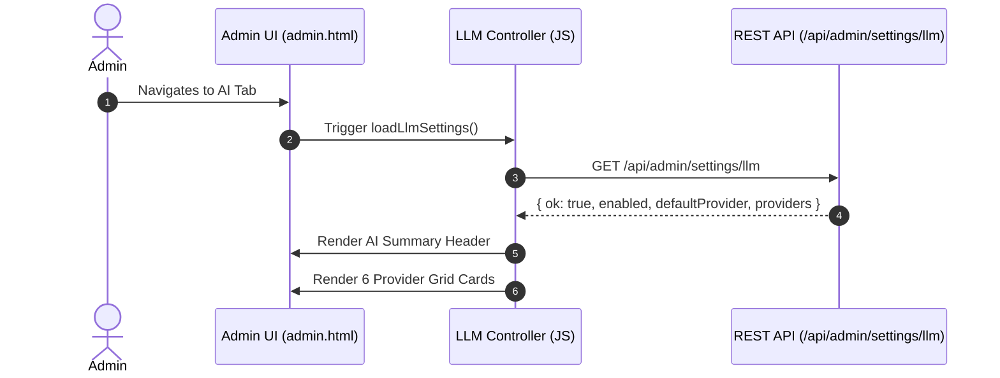
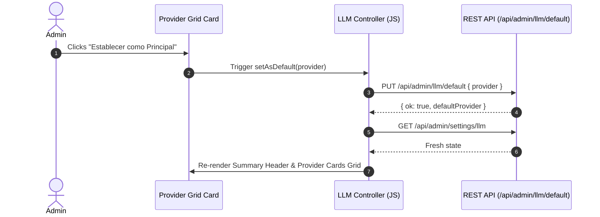
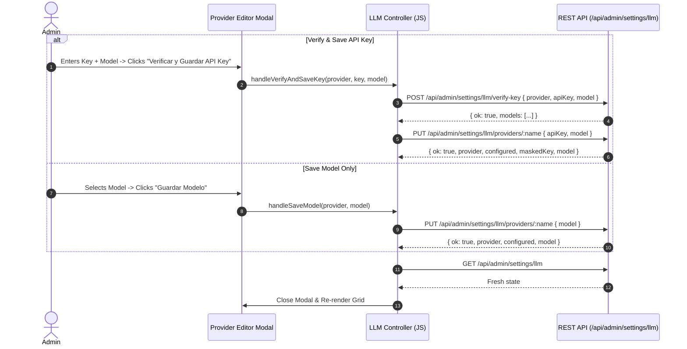

# Technical Design: AI UI Overhaul

## Technical Approach

Refactor the AI Management tab (`#tab-llm`) in `public/admin.html` into a visual dashboard. The architecture consists of three frontend UI components:
1. **AI Summary Header**: Displays global bot status, default provider/model badge, and quick toggle switch.
2. **Provider Cards Grid**: Renders visual cards for 6 providers (`openai`, `anthropic`, `openrouter`, `deepseek`, `kimi`, `qwen`) with status badges (`Configurado`/`Sin configurar`), default badges (`Proveedor Principal`), current model, 1-click default switch button, and edit modal triggers.
3. **Provider Editor Modal Drawer**: Offers masked key input (`...1234`), dynamic model catalog selector, "Verificar y Guardar API Key" (verify & update), and "Guardar Modelo" (model update without key re-verification).

All backend REST APIs exist (`GET /api/admin/settings/llm`, `PUT /api/admin/llm/default`, `POST /api/admin/settings/llm/verify-key`, `PUT /api/admin/settings/llm/providers/:name`, `PUT /api/admin/settings/llm`).

## Architecture Decisions

| Decision | Options | Rationale |
|----------|---------|-----------|
| **UI Layout Structure** | A) Inline single form<br>B) Tabbed sub-views<br>**C) Header + 6-Card Grid + Modal Drawer** | **Chosen: C**. Provides immediate visual feedback for all 6 providers at a glance, reduces form clutter, and isolates editing into a modal drawer without page reloads. |
| **JS State Management** | A) DOM scraping<br>**B) Centralized `llmState` + API refresh**<br>C) LocalStorage caching | **Chosen: B**. `llmState` caches server state. Re-fetching `GET /api/admin/settings/llm` after any mutation guarantees UI freshness and avoids stale client state. |
| **i18n Dictionary Expansion** | A) Remote JSON fetch<br>**B) Inlined 5-language `i18n` dictionary**<br>C) Separate JS bundles | **Chosen: B**. Aligns with single-file admin SPA design (`public/admin.html`). Extends `i18n` dictionaries across `es`, `en`, `pt`, `fr`, and `de` with zero external dependencies. |

## Data Flow

### 1. Initial Dashboard Render



### 2. 1-Click Default Provider Switch



### 3. Modal Key Verification & Model Save



## File Changes

| File | Action | Description |
|------|--------|-------------|
| `public/admin.html` | Modify | Re-structure `#tab-llm` markup (Summary Header, 6 Provider Cards Grid, Editor Modal). Add CSS styles for cards, badges, and modal drawer. Extend `i18n` dictionaries for `es`, `en`, `pt`, `fr`, `de`. Update JS controller (`loadLlmSettings`, `renderProviderCards`, `openProviderModal`, `saveProviderKey`, `saveProviderModel`, `setDefaultProvider`). |

## Interfaces / Contracts

### Client State Schema
```javascript
const llmState = {
  enabled: true,
  defaultProvider: 'openai',
  providers: {
    openai: { configured: true, maskedKey: '...1234', model: 'gpt-4o-mini', models: ['gpt-4o-mini', 'gpt-4o'] },
    anthropic: { configured: false, maskedKey: '', model: 'claude-3-5-sonnet-20241022', models: ['claude-3-5-sonnet-20241022'] },
    openrouter: { configured: false, maskedKey: '', model: 'gpt-4o-mini', models: [] },
    deepseek: { configured: false, maskedKey: '', model: 'deepseek-chat', models: [] },
    kimi: { configured: false, maskedKey: '', model: 'moonshot-v1-8k', models: [] },
    qwen: { configured: false, maskedKey: '', model: 'qwen-turbo', models: [] }
  }
};
```

### i18n Keys Specification
- `ai.header.title`, `ai.header.status_on`, `ai.header.status_off`, `ai.header.active_badge`
- `ai.card.configured`, `ai.card.unconfigured`, `ai.card.principal`, `ai.card.set_default`, `ai.card.edit`
- `ai.modal.title`, `ai.modal.api_key`, `ai.modal.model`, `ai.modal.verify_save_key`, `ai.modal.save_model`, `ai.modal.close`

## Testing Strategy

| Layer | What to Test | Approach |
|-------|-------------|----------|
| Unit / Manual UI | Header toggle & status updates | Click toggle in `admin.html`, verify `PUT /api/admin/llm/enabled` payload and status text change. |
| Integration | 1-Click default switch | Click "Establecer como Principal", verify API call to `/api/admin/llm/default` and DOM badge updates. |
| Integration | Modal key verify & save model | Open modal, enter key/select model, verify `/verify-key` and `PUT /providers/:name` executions. |
| i18n Verification | 5-Language dictionary completeness | Switch language between `es`, `en`, `pt`, `fr`, `de` and verify no unmapped keys appear on AI tab. |

## Threat Matrix

N/A — no routing, shell, subprocess, VCS/PR automation, executable-file classification, or process-integration boundary.

## Migration / Rollout

No migration required. Pure frontend UI enhancement consuming existing backend REST endpoints.

## Open Questions

None.
