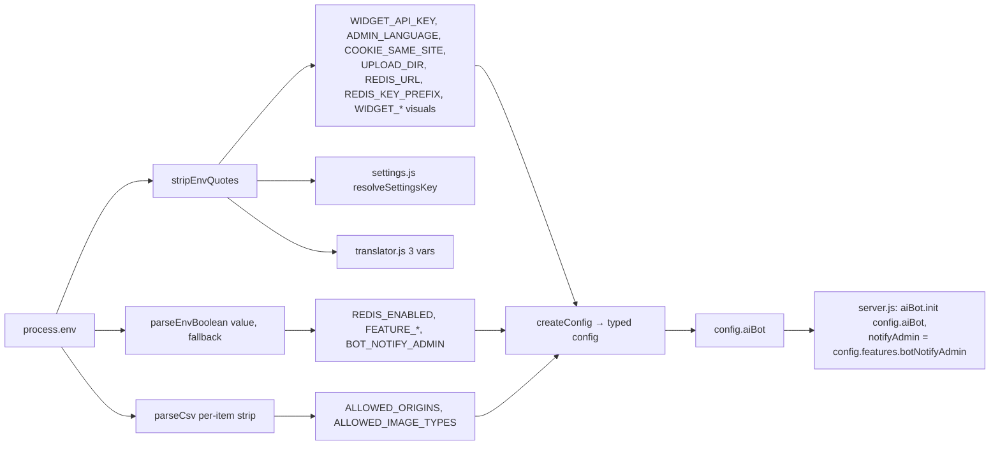

# Design: Env Quote Hygiene — normalize all `.env` reads

## Context

`setup.js` writes every `.env` value JSON-quoted (`quoteEnv = JSON.stringify`, setup.js L27), but only `TELEGRAM_TOKEN`/`ADMIN_PANEL_PASSWORD` are stripped today. 13 scoped vars read raw `process.env`, so quoted values silently break or invert behavior: CORS dies, widget embeds and uploads reject (415), features get forced ON, `REDIS_ENABLED` flips, and quoted `SETTINGS_KEY` derives a wrong AES key. Fix: reuse `stripEnvQuotes` (src/config/index.js L39-41) plus a new `parseEnvBoolean(value, fallback)` at the single normalization point `createConfig()`, and in the 3 nested consumers. `setup.js` and `.env.example` keys stay untouched (ADR-10 guardrail, enforced by `tests/setup-installer.test.js`).

## Goals / Non-goals

**Goals**: every scoped env read normalized in one place; boolean parsing with fallbacks (platform default for `REDIS_ENABLED`); `config.aiBot` block; quoted `SETTINGS_KEY` derives the intended key with a documented one-time re-entry; installer guardrail stays green.

**Non-goals**: `DB_PATH` (test-only), setup.js/.env.example key changes, dual-key SETTINGS_KEY compat, Windows behavior beyond the `REDIS_ENABLED` default, re-adding legacy `WIDGET_*`/`BOT_*`/`OPENAI_*` keys.

## Technical Approach

New leaf module `src/config/env-utils.js` (zero requires) hosting the pure helpers: `stripEnvQuotes` (moved), `parseEnvBoolean` (new), `parseCsv` (moved, now per-item strip), `parseInteger` (moved). `createConfig()` imports from it and re-exports `stripEnvQuotes` so the public config API (admin.js, config.test.js) is unchanged. Nested consumers (settings.js, translator.js) import `stripEnvQuotes` from `../config/env-utils` — no circular dependency: env-utils requires nothing, config requires nothing from services.



## Architecture Decisions

| # | Decision | Choice | Alternatives | Rationale |
|---|---|---|---|---|
| 1 | `parseEnvBoolean(value, fallback)` | strip quotes → lowercase; `true/1/yes`→true, `false/0/no`→false, empty/unknown→fallback. `REDIS_ENABLED` fallback = `process.platform !== 'win32'` | naive `Boolean()`, flatten unset→false | Spec contract; unset REDIS_ENABLED must keep the platform default (never flattened); unknown→fallback is fail-safe (no inversion of quoted `"false"`) |
| 2 | SETTINGS_KEY strip, no dual-key | strip env value before the 64-hex regex / sha256; breaking, no "try both" path | dual-key try-both compat | User decision (a) LOCKED: simplest, no key-confusion surface; only quoted setups are affected; re-entry is one-time |
| 3 | BOT_NOTIFY_ADMIN single read | `config.features.botNotifyAdmin = parseEnvBoolean(env, false)`; server.js passes it to `aiBot.notifyAdmin`; raw server.js read (L97) removed | keep raw reads in both places | Single source of truth; fixes the today-inverted `"true"`→false; aiBot block stays env-free of notifyAdmin |
| 4 | translator/settings import | shared leaf `src/config/env-utils.js`; services import `stripEnvQuotes` from `'../config/env-utils'` | import from `'../config'` (admin.js pattern) | `config/index.js` runs `require('dotenv').config()` at load — importing it from services would parse a dev's real `.env` into service-test processes (SETTINGS_KEY/TRANSLATION_* leakage). env-utils has zero deps: explicit direction services → utils ← config, no cycle |
| 5 | WIDGET_* legacy read-only | strip at read time only; setup.js/.env.example untouched; setup-installer.test.js untouched | re-add keys to installer | ADR-10 guardrail; test asserts legacy keys absent while `WIDGET_API_KEY` stays (bootstrap embed credential) |
| 6 | ALLOWED_IMAGE_TYPES per-item strip | `parseCsv` maps `stripEnvQuotes` per item, then filters | strip whole string only | setup.js writes whole-list quoted `"image/jpeg,image/png"` → naive split yields `'"image/jpeg'` → MIME match fails → 415 on ALL uploads; per-item strip also covers per-item-quoted lists |
| 7 | Test strategy | extend config/settings/translator-adapters tests (no new unit file); NEW `tests/quoted-env-boot.test.js` full-boot E2E + 1-line package.json entry | new unit test file; extend api.test.js | `npm test` is an explicit file list → new file needs a package.json entry; E2E needs its own fully-quoted env (env is read at createConfig) so a separate file mirrors api.test.js's boot pattern on PORT 3100 (api.test.js uses 3099) |

## Data / Config Model Changes

- **NEW `config.aiBot`**: `{ mode: stripEnvQuotes(BOT_MODE) || 'disabled', openaiKey: stripEnvQuotes(OPENAI_API_KEY), model: stripEnvQuotes(OPENAI_MODEL) || 'gpt-4o-mini', maxTokens: parseInteger(OPENAI_MAX_TOKENS, 300), systemPrompt: stripEnvQuotes(BOT_SYSTEM_PROMPT) || default, confidenceThreshold: parseFloat(stripEnvQuotes(BOT_CONFIDENCE_THRESHOLD)) || 0.6, contextMessages: parseInteger(BOT_CONTEXT_MESSAGES, 6) }`. `kbPath`/`logger` stay server.js-side. `BOT_MODE` keeps `|| 'disabled'`.
- `config.features.botNotifyAdmin`: raw `=== 'true'` → `parseEnvBoolean(env, false)`.
- `config.redis.enabled`: `parseEnvBoolean(env, process.platform !== 'win32')` (unset keeps platform default; quoted `"false"` disables on every platform).
- `config.features.*`: `parseEnvBoolean(env, legacyConfig?.features?.x ?? true)` (legacy boolean fallback preserved).
- `config.uploads.dir`, `config.redis.url/prefix`, `config.admin.cookieSameSite/language`, `config.widget.*`, `config.server.corsOptions.origin`, `config.uploads.allowedImageTypes`: quote-stripped.

```mermaid
flowchart TD
  Q["SETTINGS_KEY=\"<64 hex>\" (setup.js output)"] --> STRIP[stripEnvQuotes]
  STRIP --> HEX{64-hex?}
  HEX -- yes --> BUF[Buffer.from hex, unquoted]
  HEX -- no --> SHA[sha256 stripped value]
  BUF --> KEY[derived key CHANGED vs old quoted derivation]
  SHA --> KEY
  KEY --> DEC[resolveLlmBootConfig decrypt fails]
  DEC --> WARN[server.js boot warning: one-time re-entry]
  WARN --> RE[operator re-saves LLM provider keys<br/>in Admin → AI tab, re-encrypts with new key]
```

## File Changes

| File | Action | Description |
|---|---|---|
| `src/config/env-utils.js` | Create | Leaf pure-helpers module: `stripEnvQuotes`, `parseEnvBoolean`, `parseCsv` (per-item strip), `parseInteger`. Zero requires. |
| `src/config/index.js` | Modify | Import helpers from env-utils; re-export `stripEnvQuotes` (API unchanged); strip COOKIE_SAME_SITE, ADMIN_LANGUAGE, WIDGET_* (L107-110), REDIS_URL/PREFIX, UPLOAD_DIR; `parseEnvBoolean` for features/REDIS_ENABLED/BOT_NOTIFY_ADMIN; per-item strip via parseCsv for ALLOWED_ORIGINS/ALLOWED_IMAGE_TYPES; new `config.aiBot` block. |
| `src/services/settings.js` | Modify | `resolveSettingsKey` strips `SETTINGS_KEY` (env or opts) via `stripEnvQuotes` before trim/hex/sha256. No dual-key path. |
| `src/services/translator.js` | Modify | Strip `TRANSLATION_PROVIDER`/`TRANSLATION_API_KEY` (getProviderConfig L19-25) and `DEEPL_API_URL` (L52). |
| `server.js` | Modify | `aiBot.init({ ...config.aiBot, notifyAdmin: config.features.botNotifyAdmin, kbPath, logger })`; enhance boot warning (L552) to instruct one-time secret re-entry. |
| `tests/config.test.js` | Modify | parseEnvBoolean unit cases; quoted createConfig cases (strings, CSV, booleans, aiBot, WIDGET_*). |
| `tests/settings.test.js` | Modify | Quoted 64-hex SETTINGS_KEY → hex buffer; quoted non-hex → sha256(stripped). |
| `tests/translator-adapters.test.js` | Modify | Quoted provider/key/DEEPL_API_URL honored. |
| `tests/quoted-env-boot.test.js` | Create | Fully-quoted env boot E2E (api.test.js pattern, telegraf mock, DB_PATH `:memory:`, PORT 3100). |
| `package.json` | Modify | Add the E2E file to the explicit `test` list (1 line). |
| `.env.example` | Modify | Wording polish only (quote-stripping note L13-14 already present); no key adds/removals. |

## Testing Strategy

All 15 env-normalization + 4 admin-settings scenarios get a mechanism: R1-S1..S4 (strip → config fields), R2-S5/S6 (parseCsv per-item), R3-S7/S8/S9/S10 (parseEnvBoolean + platform fallback), R4-S11/S12 (`|| 'disabled'`, parseInteger/parseFloat), R5-S13 (translator strip), R6-S14/S15 (guardrail untouched; visuals stripped), A1/A2 (settings strip), A3/A4 (no dual-key; boot warning).

| Layer | What | Approach |
|---|---|---|
| Unit | helpers + createConfig | config.test.js extensions |
| Unit | resolveSettingsKey quoted cases | settings.test.js extensions |
| Unit | translator quoted vars | translator-adapters.test.js extensions |
| E2E | fully-quoted .env boot | `tests/quoted-env-boot.test.js`: `/health` features false; `ALLOWED_IMAGE_TYPES` upload 200; WIDGET_API_KEY embed auth; CORS preflight; REDIS_ENABLED false → redis disabled; UPLOAD_DIR quoted → files land; translator quoted provider honored |

## Threat Matrix

`N/A` — no routing, shell, subprocess, VCS/PR automation, executable-file classification, or process-integration boundary. No new auth/CSRF boundary: COOKIE_SAME_SITE quoted `"strict"` is now honored (previously downgraded to lax — security improvement) and WIDGET_API_KEY auth starts working when quoted (repair, not a new boundary).

## Migration / Rollout

**SETTINGS_KEY breaking migration (quoted deployments only)**: ① deploy the update; ② boot — `resolveLlmBootConfig` decrypt fails, warning logged instructing one-time secret re-entry, boot continues; ③ operator logs into /admin → AI tab and re-saves each LLM provider key (re-encrypted with the new, unquoted derivation); ④ verify bot rehydrates (`/health`, bot replies). No DB migration and no re-encryption ever happens server-side.

**Rollback**: revert slices in reverse order — restoring old code restores the old key derivation, so previously encrypted secrets decrypt again (nothing was re-encrypted on disk). Docs change is cosmetic.

**Delivery**: 3 stacked slices, auto-chain to main — ① config core + env-utils + config.test.js; ② nested consumers (settings/translator/server.js) + their tests; ③ `.env.example` polish + E2E + package.json entry.

## Open Questions

None — all decisions locked (m0715): no dual-key (a), read-only WIDGET_* (b), bonus vars included (c).
