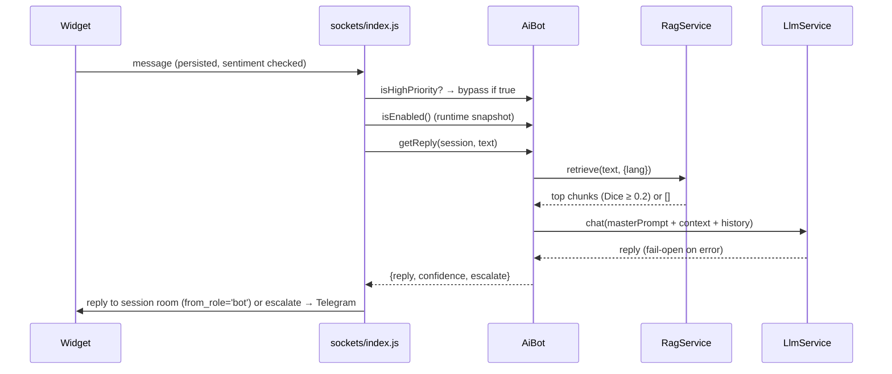
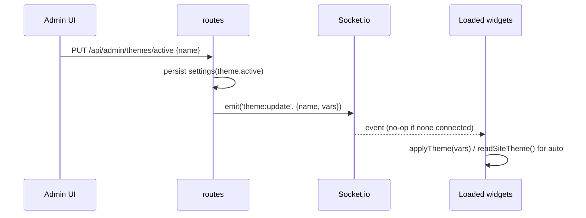

# Design: LLM RAG Overhaul

Multi-provider LLM + admin-managed RAG/prompt/themes/Telegram, with settings persistence and runtime reconfigure. Tooling-hygiene lands first; kb-trainer is deleted last. Stable bot contract (`isEnabled()`, `getReply(session, text)`), fail-open providers, sentiment bypass and visitor image allowlist untouched.

## Technical Approach

New modules `src/services/{settings,llm,rag,themes,master-prompt}.js` + `src/services/text-match.js` (stemmer/Dice extracted from `ai-bot.js`). Tooling-hygiene lands first per proposal decision (b), verbatim: engines `>=22`, CI matrix `[22, 24]`, Docker `node:24`. `AiBot` becomes a thin orchestrator: master prompt + RAG context → active LLM adapter. All config lives in a `settings` KV table; services re-init via atomic config swaps (`configure()`), no restarts. DI factories (`createX(deps)`), CommonJS, no build step, snake_case ↔ camelCase.

## Architecture Decisions

### ADR-1: API keys at rest — AES-256-GCM

**Choice**: Encrypt provider keys with AES-256-GCM (`crypto`). Key from env `SETTINGS_KEY` (64 hex chars); if absent, generate once and persist to `data/.settings-key` (chmod 0600). Stored format: `v1.<iv>.<tag>.<ct>` base64. API responses return only `{configured: true, maskedKey: '…' + last4}`.
**Alternatives**: plaintext in SQLite (rejected: spec forbids exposure, DB dumps leak keys); hard-fail without `SETTINGS_KEY` (rejected: breaks zero-config self-hosted installs).
**Rationale**: authenticated encryption, no new deps, env-override for hardened deployments, file fallback keeps installer simple. Key never logged; decrypt only inside the LLM service.

### ADR-2: Anthropic adapter — port before deletion

**Choice**: Port `callAnthropic` from `kb-trainer/ai-client.js` (lines 183–200) into `src/services/llm/anthropic.js` BEFORE any kb-trainer removal: `x-api-key` header, `anthropic-version: 2023-06-01`, top-level `system` field, mandatory `max_tokens`, reply at `data.content[0].text`. Extraction order: (1) text-match util, (2) LLM adapters, (3) RAG fetcher, (4) identity content, (5) migration, (6) delete kb-trainer.
**Rationale**: the working protocol implementation exists only in kb-trainer; porting first means the delete step is pure removal with green tests throughout.

### ADR-3: Boot without TELEGRAM_TOKEN — persisted fallback secret

**Choice**: `validateConfig` downgrades missing token to a warning (admin-ID numeric check only when token present). Admin-cookie HMAC secret becomes `resolveAdminSigningSecret()`: `telegramToken` if set, else a 32-byte random hex created once at `data/.admin-secret` (0600). Telegram module reports `not-configured`.
**Alternatives**: sign with password alone (rejected: password-only HMAC weakens the two-secret model); random per-boot secret (rejected: every restart logs all admins out).
**Rationale**: persisted file keeps cookies valid across restarts without a token. If a token is added later, the signing secret changes and existing cookies invalidate once — admin re-logs in; documented in the UI. No migration of existing cookies needed: deployments with a token are byte-identical to today.

### ADR-4: PDF parser — pdfjs-dist v3 legacy (CJS)

**Choice**: `pdfjs-dist@^3.11` pinned, `require('pdfjs-dist/legacy/build/pdf.js')` inside wrapper `src/services/rag/pdf.js` (`extractText(buffer)` iterating pages).
**Alternatives**: `pdf-parse` (rejected: unmaintained since 2021, import-time side effect reading a test PDF when `module.parent` is unset — footgun under `node --test`); pdfjs-dist v4+ (rejected: ESM-only, incompatible with our no-build CommonJS).
**Rationale**: Mozilla-maintained, CJS legacy build, admin-only path so bundle weight is acceptable.

### ADR-5: RAG v1 retrieval — lexical, embeddings-ready contract

**Choice**: Chunking ~900 chars with 150-char overlap, split on paragraph/sentence boundaries. Scoring reuses tokenize+stem+Dice from new `src/services/text-match.js` (extracted from `ai-bot.js`); top 4 chunks, min score 0.2, ≤1800 chars injected into the system prompt as a "Knowledge context" section. Interface (async, so v2 embeddings swap in without caller changes):

```js
retrieve(query, { lang, limit = 4 }) → [{ chunkId, documentId, text, score }]
ingestText({ sourceType, source, title, text }) → { documentId, chunkCount }
```

**Rationale**: zero external calls/deps, reuses proven matching code; interface hides lexical vs vector.

### ADR-6: Settings table + atomic runtime reconfigure

**Choice**: `settings(key PK, value JSON, updated_at)`. Services hold an immutable config snapshot; `configure(next)` assigns `this.config = Object.freeze({...})` wholesale — never field mutation. Node is single-threaded, so in-flight Socket.io handlers keep the old snapshot and new events see the new one; no locks needed. `isEnabled()` reads the snapshot (`ai.enabled && default provider ready`), not boot env. LLM clients are cached per provider and rebuilt on `configure`.
**Rationale**: atomic swap is the cheapest correct concurrency model here; matches the existing singleton-service style.

### ADR-7: Live theme push — `theme:update` broadcast

**Choice**: Catalog as code in `src/services/themes.js` — presets `auto`, `classic`, `light-aurora`, `light-mint`, `dark-midnight`, `dark-ember`, each a full 13-var CSS map. Active name in settings (`theme.active`). On change: `io.emit('theme:update', { name, vars })` on the visitor namespace; widget adds `socket.on('theme:update', …)` → if `name==='auto'` re-run `readSiteTheme()`, else apply the var map. `/config-public` gains `theme: { name, vars|null }`. Zero widgets connected = no-op emit. Implementation note for apply: verify in `src/sockets/index.js` which namespace/rooms widgets actually join (they connect on the default namespace and join `session:{id}` rooms) so `theme:update` reaches every connected widget — use a namespace-level emit, not a room-scoped one.
**Alternatives**: themes table (rejected: presets are reviewed code, not user data; settings stores only the selection).
**Rationale**: one emit, existing CSS-var architecture makes application trivial; `auto` untouched.

### ADR-8: Admin UI — tabbed sections in admin.html

**Choice**: Tab bar over the existing single page: **Chats** (current), **AI**, **Knowledge**, **Prompt**, **Telegram**, **Appearance**. Inline JS/CSS per CSP ('self' + inline), `data-i18n` keys added to all 5 dictionaries with English fallback. All endpoints under `requireAdmin` + `requireCsrf` (mutations).
**Rationale**: admin.html is a deliberately single-file, CSP-inline, same-origin page; in-page tabs extend that convention without introducing routing, build tooling, or extra HTML entry points.

### ADR-9: kb-trainer extraction/removal order

**Choice**: (1) extract `stem/normalize/Dice` → `text-match.js`; (2) port Anthropic protocol → `llm/anthropic.js`; (3) port `fetcher/stripHtml` → `rag/url-fetcher.js`; (4) port `fixed-entries.js` identity answers (condensed, 6 langs) into the built-in default master prompt; (5) run `scripts/migrate-kb-to-rag.js`; (6) delete `kb-trainer/`, `tests/kb-trainer.test.js`, KB code paths in `ai-bot.js` (matchKnowledge/disambiguation/`BOT_MODE=knowledge-base`), setup.js bot section, Dockerfile COPY. In the same sweep: remove the personal `HELP_TOPICS` content in `src/sockets/index.js` (~L32, ~L227) — its answers are absorbed by the master-prompt/RAG system per the proposal — and collapse the duplicated `resolveTelegramReplySessionId` to ONE canonical implementation in `src/telegram/bot.js` (telegram owns reply routing); the server.js:484-490 copy is removed, with server.js re-exporting from the telegram module if tests still need the symbol.
**Rationale**: every step keeps tests green; deletion is the final, trivially revertible step.

### ADR-10: Installer minimization

**Choice**: setup.js **drops**: `widgetSec` visual keys (primary color, button style, welcome), `botSec` entirely (BOT_MODE/OPENAI_*/BOT_*), the dead `knowledge-base.json.example` copy block (setup.js:1044-1052), `BOT_NOTIFY_ADMIN` (moves to settings). **Keeps**: telegramSec, serverSec, featuresSec (feature flags), transSec, rateSec, uploadSec, redisSec, nodeSec, dockerSec, `WIDGET_API_KEY` (bootstrap embed credential: it must exist before the admin panel is ever configured, identifies embedded installs at socket handshake, and moving it to the settings table would break existing deployments' snippets). Adds optional `SETTINGS_KEY`. Legacy re-run safety: `mergedDefaults` already absorbs unknown old keys silently; obsolete keys are ignored, never re-asked. `.env.example`: remove Smart-Bot/kb-trainer/widget-visual sections, document `SETTINGS_KEY`. Dockerfile: drop `COPY kb-trainer`; node:24 unchanged. Compose: refresh env examples only.

## Data Flow (sequence diagrams)

### Visitor message → LLM+RAG reply



### Admin key verification

```mermaid
sequenceDiagram
  participant A as Admin UI
  participant R as routes/admin.js
  participant L as LlmService
  participant DB as settings
  A->>R: PUT /api/admin/llm/providers/:name (requireAdmin+requireCsrf)
  R->>L: verify(provider, key, model) — 1-token test call
  alt valid
    L-->>R: ok
    R->>DB: save AES-256-GCM(key)
    R-->>A: {configured, maskedKey}
  else 401/network
    R-->>A: error; config unchanged
  end
```

### Theme live push



### KB migration (one-time script)

```mermaid
sequenceDiagram
  participant M as migrate-kb-to-rag.js
  participant F as data/knowledge-base.json
  participant DB as rag_*
  M->>F: read; if missing → "nothing to migrate", exit 0
  M->>F: copy to knowledge-base.<ts>.bak
  loop per entry
    M->>DB: INSERT document+chunks OR IGNORE (hash=sha256(kb:id:lang))
  end
  M-->>M: report counts (idempotent re-run)
```

## Data Model

```sql
CREATE TABLE IF NOT EXISTS settings (
  key TEXT PRIMARY KEY, value TEXT NOT NULL, updated_at INTEGER NOT NULL);
CREATE TABLE IF NOT EXISTS rag_documents (
  id INTEGER PRIMARY KEY AUTOINCREMENT,
  source TEXT NOT NULL, source_type TEXT NOT NULL CHECK(source_type IN ('url','pdf','kb-migration')),
  title TEXT, content_hash TEXT NOT NULL UNIQUE, created_at INTEGER NOT NULL);
CREATE TABLE IF NOT EXISTS rag_chunks (
  id INTEGER PRIMARY KEY AUTOINCREMENT,
  document_id INTEGER NOT NULL REFERENCES rag_documents(id) ON DELETE CASCADE,
  seq INTEGER NOT NULL, text TEXT NOT NULL, created_at INTEGER NOT NULL);
CREATE INDEX IF NOT EXISTS idx_rag_chunks_doc ON rag_chunks(document_id, seq);
```

Settings keys: `ai.enabled`, `llm.default_provider`, `llm.provider.<name>` (`{encKey, model, verifiedAt}`), `master_prompt.text`, `theme.active`, `telegram.admin_id`.

## Endpoint Inventory

| Module | Endpoint | Notes |
|---|---|---|
| AI | `GET /api/admin/llm` | providers, masked keys, default, `ai.enabled` |
| AI | `PUT /api/admin/llm/providers/:name` | verify → encrypt → save `{apiKey?, model}` |
| AI | `PUT /api/admin/llm/default` `{provider}` | select default |
| AI | `PUT /api/admin/llm/enabled` `{enabled}` | global switch |
| Knowledge | `GET/DELETE /api/admin/rag/documents[/:id]` | list/remove (cascades chunks) |
| Knowledge | `POST /api/admin/rag/ingest-url` `{url}` | 10s timeout, non-2xx rejected |
| Knowledge | `POST /api/admin/rag/ingest-pdf` | multer memory, `%PDF-` bytes, 5 MB |
| Prompt | `GET/PUT /api/admin/master-prompt` | default fallback when unset |
| Telegram | `GET /api/admin/telegram/status` | running/stopped/not-configured |
| Telegram | `POST /api/admin/telegram/start|stop` | runtime control |
| Telegram | `PUT /api/admin/telegram/admin-id` | numeric only |
| Appearance | `GET /api/admin/themes` / `PUT /api/admin/themes/active` | catalog + live push |

## File Changes

| File | Action | Description |
|---|---|---|
| `src/services/settings.js` | Create | KV read/write + AES-256-GCM helpers |
| `src/services/text-match.js` | Create | stem/normalize/Dice extracted from ai-bot |
| `src/services/llm/{index,openai-compatible,anthropic}.js` | Create | adapter registry; openai pkg + baseURL; native fetch Anthropic |
| `src/services/rag/{index,chunker,url-fetcher,pdf}.js` | Create | ingest + lexical retrieve |
| `src/services/themes.js` | Create | preset catalog |
| `src/services/master-prompt.js` | Create | default prompt + identity answers |
| `scripts/migrate-kb-to-rag.js` | Create | one-time import, backup, idempotent |
| `src/services/ai-bot.js` | Modify | orchestrator over LLM+RAG; drop KB mode |
| `src/security/admin-auth.js`, `src/config/index.js` | Modify | ADR-3 fallback secret; soft token validation |
| `src/routes/admin.js`, `public/admin.html`, `widget.js`, `src/telegram/bot.js`, `server.js` | Modify | endpoints, tabs, theme listener, runtime control, wiring; server.js drops its duplicate `resolveTelegramReplySessionId` (canonical: `src/telegram/bot.js`) |
| `src/sockets/index.js` | Modify | remove personal `HELP_TOPICS` content (~L32, ~L227) — absorbed by master-prompt/RAG |
| `db.js`, `package.json`, `setup.js`, `.env.example`, `Dockerfile`, CI | Modify | tables, engines/tests/Biome/pdfjs, installer, image |
| `kb-trainer/`, `tests/kb-trainer.test.js`, `scratch/`, `data/knowledge-base.json` | Delete | last step, after migration backup |

## Testing Strategy

| Layer | What | Approach |
|---|---|---|
| Unit | text-match, chunker, settings crypto round-trip, adapters (mock fetch), retrieval ranking, theme catalog | `node --test`, new test files |
| Integration | new endpoints (auth/CSRF negatives, verify flow, PDF magic/size, URL errors), boot without token, theme push, migration idempotency | real server, stubbed env (api.test.js pattern) |
| Regression | sentiment bypass, translation, attachments allowlist, telegram routing | existing 11 files, all in `npm test` |

## Threat Matrix

N/A — no shell, subprocess, VCS/PR automation, executable-file classification, or process-integration boundary. New HTTP routes are covered by the requireAdmin/requireCsrf spec requirements and their RED tests.

## Migration / Rollout

Phases: (1) tooling-hygiene; (2) settings + LLM; (3) RAG + migration script; (4) prompt/Telegram/themes UI; (5) kb-trainer deletion; (6) Docker rebuild LAST. Rollback: global AI off switch; `git revert` for deletion; KB backup before import.

## Open Questions

- [ ] Exact preset var values for the 4 creative themes (design tokens chosen at apply time).
