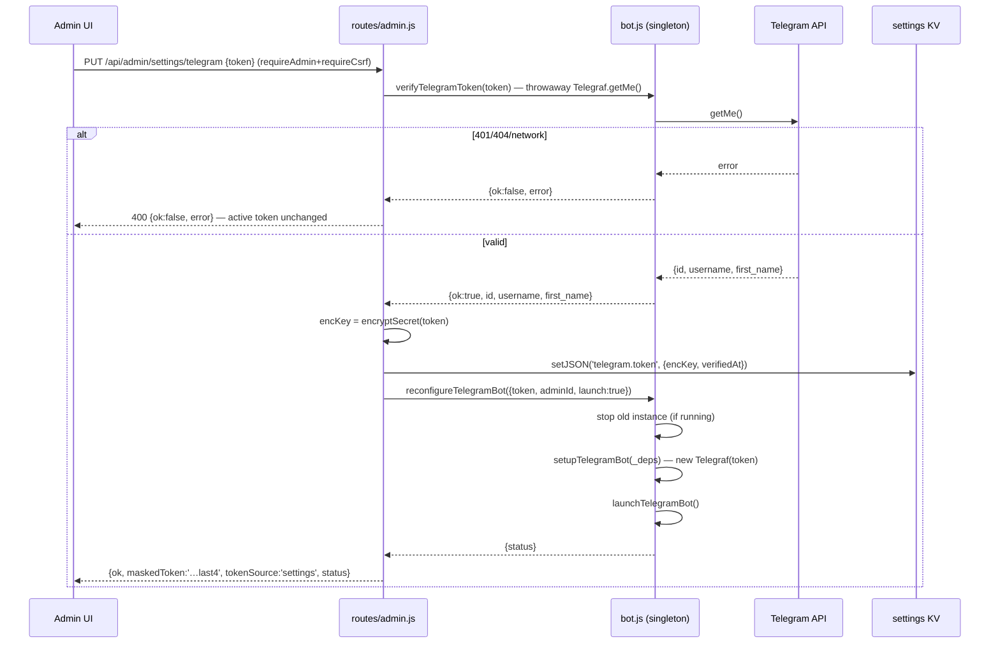
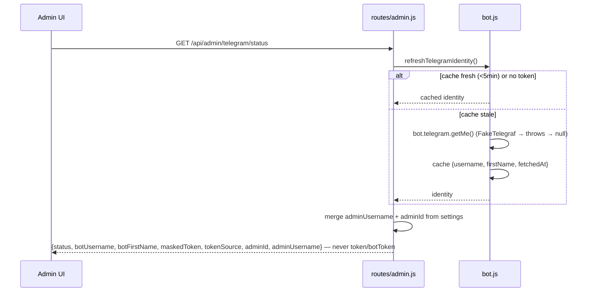

# Design: Telegram Control — Token & Admin Fields in the Admin UI, 404 Fix

## Context

`setup.js` writes every `.env` value with `JSON.stringify` (`quoteEnv`, setup.js:27), so `TELEGRAM_TOKEN` reaches `src/config/index.js` L80 as `"8609…:AAEG…"` with literal quotes. `ADMIN_PANEL_PASSWORD` (L107) strips quotes, but the token is read raw → Telegraf gets a quoted token → Telegram API 404 → bot never launches, `/health` shows `telegramReady:false`. The token itself is valid (getMe: ChatVivo_Wilkin_bot, id 8609135566; admin @WilkinBR / 7051275102). This change fixes the 404, makes the token/identity/admin-username UI-manageable, decouples admin HMAC from the token, and fixes the missing `telegram.saved` i18n key. Specs: `specs/telegram-admin/spec.md`, `specs/admin-settings/spec.md`.

## Goals

- Shared `stripEnvQuotes()` in `src/config/index.js` (strip `^["']|["']$` + trim), applied to the `TELEGRAM_TOKEN` read (L80), mirroring L107.
- Settings-backed token: `telegram.token` stored AES-256-GCM as `{encKey, verifiedAt}` via `settingsService.encryptSecret`; precedence **settings > env > none**, resolved in `server.js start()` after `initDb`; decrypt failure → warn + env fallback, never crash.
- New bot.js exports: `verifyTelegramToken(token)` (throwaway `new Telegraf(token).telegram.getMe()`) and `reconfigureTelegramBot({token, adminId, launch})` (stop if running → mutate `_deps` → re-setup → optional launch).
- Admin PUT dispatch token-vs-adminId-vs-adminUsername; token flow mirrors the LLM verify-then-save pattern (admin.js L384-394).
- Lazy identity: `getTelegramStatus()` gains `botUsername`/`botFirstName` (cached getMe, NEVER at boot/launch — FakeTelegraf safety) + `maskedToken`/`tokenSource`. Field-name constraint: never `token`/`botToken` (tests assert `undefined`, telegram-admin.test.js L207-208).
- HMAC decoupling: `resolveAdminSigningSecret` always uses persisted `data/.admin-secret` (create on first boot); one-time re-login accepted and documented.
- `adminUsername` (@WilkinBR) as informational settings key `telegram.admin_username`, surfaced in status; numeric admin ID validation unchanged.
- i18n: add `telegram.saved` + new token-UI keys to all 5 dicts (es/en/pt/fr/de); keep the existing 12 `telegram.*` keys and DOM ids (`tab-btn-telegram`, `tab-telegram`, `telegram-admin-id-input`, `btn-telegram-start/stop/refresh`, `btn-save-telegram-admin-id`).

## Non-Goals

Sibling quoted-env bugs (ALLOWED_ORIGINS, WIDGET_API_KEY, REDIS_URL, FEATURE_*, etc.) → separate follow-up reusing `stripEnvQuotes`. Webhooks, multi-admin roles, message-history export, reply routing, Spanish translation of UI copy, stable bot contract changes. Token encryption-key rotation migration (existing `data/.settings-key` kept).

## Technical Approach

Six coordinated changes across config, bot module, admin router, admin-auth, server wiring, admin.html, and tests. The bot module keeps its singleton pattern: all runtime mutation flows through `setupTelegramBot(deps)` / `reconfigureTelegramBot`, so server.js and admin.js always act on the same Telegraf instance (admin.js:45 `deps.telegramBot || require('../telegram/bot')` returns the same module object server.js configured). No schema changes — only `settings` KV rows.

## Architecture Decisions

### ADR-1: `stripEnvQuotes()` — shared, exported, applied to token read

| Option | Tradeoff | Decision |
|---|---|---|
| Inline regex at L80 | duplicates L107, no reuse for follow-up env fixes | ✗ |
| Exported helper in config | one canonical normalization, testable, reuse for quoted-env sweep | ✓ |

`stripEnvQuotes(value)` = `typeof value === 'string' ? value.replace(/^["']|["']$/g, '').trim() : ''`. Exported from `src/config/index.js`; applied to `telegramToken` (L80) and reused by the `ADMIN_PANEL_PASSWORD` read (L107 refactor to call it). `parseInteger` keeps its own quote-strip (already correct). Follow-up sibling fixes call the same helper.

### ADR-2: Settings-backed token — encrypted `{encKey, verifiedAt}`, precedence settings > env > none

| Option | Tradeoff | Decision |
|---|---|---|
| Plaintext token in settings | DB dump leaks the token | ✗ |
| Encrypted via existing `encryptSecret` (AES-256-GCM `v1.<iv>.<tag>.<ct>`) | zero new deps, matches LLM key storage | ✓ |
| Settings wins over env | admin UI becomes authoritative; env is a bootstrap/default | ✓ (spec) |

`telegram.token` = `JSON {encKey, verifiedAt}` (`encKey` = `encryptSecret(token)`). Boot resolution: read `settingsService.getJSON('telegram.token')` → `decryptSecret(encKey)`; on throw → `logger.warn` + env fallback; then `config.telegram.token` (stripped); else `null` → bot reports `not-configured`. Resolution lives in a new exported helper `resolveTelegramToken({settingsService, envToken, logger})` in bot.js (DI-clean, telegram-specific), used by `server.js start()` after `initDb`.

### ADR-3: `verifyTelegramToken` + `reconfigureTelegramBot` — new bot.js exports

| Option | Tradeoff | Decision |
|---|---|---|
| Verify inside route | couples routes to Telegraf internals; untestable with mocks | ✗ |
| `verifyTelegramToken(token)` in bot.js | throwaway `new Telegraf(token).telegram.getMe()`; returns `{ok, id, username, first_name, error}`; no polling started; FakeTelegraf-safe (only invoked on explicit save) | ✓ |
| Restart required | violates runtime-reconfigure spec | ✗ |
| `reconfigureTelegramBot({token, adminId, launch})` | stop if running → `_deps = {..._deps, token, adminId}` → `setupTelegramBot(_deps)` → optional `launchTelegramBot` | ✓ |

`reconfigureTelegramBot` with `launch:true` is the live-apply path for token saves (stop→setup→launch, spec `Telegram token reconfigure applies live`). With `launch:false` it swaps credentials while stopped (clear/empty-save path).

### ADR-4: `startTelegramBot` always re-setups from `_deps`

| Option | Tradeoff | Decision |
|---|---|---|
| Keep `if (!bot && _deps)` (current L283) | a token changed while stopped is NOT picked up — stale launch | ✗ |
| `if (_deps) setupTelegramBot(_deps)` before launch | recreates Telegraf with freshly mutated `_deps`; idempotent when stopped | ✓ |

After a reconfigure while stopped, `_deps.token` holds the new credential; `startTelegramBot` must consume it. Rebuilding the Telegraf instance is harmless (no polling active when stopped) and matches the "freshly resolved token" requirement.

### ADR-5: PUT dispatch — one handler for token/adminId/adminUsername on both aliases

| Option | Tradeoff | Decision |
|---|---|---|
| New separate token endpoint | third URL; UI keeps two save paths | ✗ |
| Dispatch inside shared handler bound to `/api/admin/telegram/admin-id` AND `/api/admin/settings/telegram` | mirrors LLM dispatch (handlePutLlmSettings L436-454); backward compatible | ✓ |

Body dispatch: `token` present → token flow (verify → encrypt → `setJSON('telegram.token', {encKey, verifiedAt})` → `reconfigureTelegramBot({token, adminId, launch:true})`); `token === ''` → clear: `settingsService.delete('telegram.token')` → reconfigure with env token (or stop); `adminId`/`admin_id` → existing numeric flow (`setTelegramAdminId`, no restart — command auth reads `_adminId` live); `adminUsername` → `set('telegram.admin_username', v)` (informational, no restart); else 400. All under `requireAdmin` + `requireCsrf`.

### ADR-6: PUT response shape — masked, source-annotated, never full token

Response (all token mutations): `{ ok: true, maskedToken: maskSecret(token) → '…last4', tokenSource: 'settings'|'env'|'none', status }`. Verify failure → `400 { ok:false, error }`, active token unchanged (spec `Invalid token rejected`). Empty-save success → `tokenSource:'env'` (or `'none'`), `maskedToken` from env token. Route never returns `token`/`botToken`.

### ADR-7: `telegramReady` stale-closure mitigation — health getter consults bot status

| Option | Tradeoff | Decision |
|---|---|---|
| Keep `let telegramReady` boolean updated by hand | stale after reconfigure (server.js:489 closure reads the old var) | ✗ |
| `get telegramReady() { return getTelegramStatus().status === 'running'; }` | always reflects the live singleton; removes the manual var | ✓ |

`createHealthRouter` injection (server.js:489) becomes a getter over `getTelegramStatus()`. The module-level `telegramReady` variable and its assignments (L550/553) and `shutdown` check (L562) are replaced by `getTelegramStatus().status === 'running'` / `getBot()` presence checks. `/health` then reflects reconfigure immediately (spec requirement).

### ADR-8: HMAC decoupling — `resolveAdminSigningSecret` ignores telegram token

| Option | Tradeoff | Decision |
|---|---|---|
| Keep token-as-secret (current L17-21) | rotating the token logs out the admin; settings token makes HMAC secret volatile | ✗ |
| Always `data/.admin-secret` (create 0600 on first boot) | stable across token rotation; matches LLM `SETTINGS_KEY` file-fallback pattern; one-time re-login on first deploy of this change | ✓ |

`resolveAdminSigningSecret({secretFilePath})` drops the `telegramToken` branch. `createAdminAuth` drops the `telegramToken` param (server.js:247 removed). Existing installs: deployments that booted WITH a token never wrote `.admin-secret` (current code returns the token early), so the first boot after this change creates it → HMAC secret changes → **one-time re-login**, documented in README + admin panel notice. No secret regeneration for token-less installs (file already exists).

### ADR-9: Lazy identity with cache — never at boot/launch

| Option | Tradeoff | Decision |
|---|---|---|
| getMe at boot/launch | FakeTelegraf lacks `getMe` (api.test.js:30-44, telegram-routing.test.js:22-34) → integration breakage | ✗ |
| Lazy: `refreshTelegramIdentity()` (cache ~5 min) called from the GET status route only | boot stays FakeTelegraf-safe; identity fills on first status view | ✓ |

Module state `_identity = {username, firstName, fetchedAt}`; `getTelegramStatus()` returns cached values (null until first refresh). Admin GET status handler awaits refresh then returns status. `verifyTelegramToken` is the only getMe call on demand — explicit admin save only.

### ADR-10: Settings keys — exact names

| Key | Value | Semantics |
|---|---|---|
| `telegram.token` | `{encKey, verifiedAt}` (encrypted) | bot credential (new) |
| `telegram.admin_id` | numeric string | existing admin auth (unchanged) |
| `telegram.admin_username` | string e.g. `@WilkinBR` | informational only, no auth semantics (new) |

`adminUsername` is read by the status route directly from settings; it is NOT wired into bot authorization. `adminId` resolution at boot: settings `telegram.admin_id` > env `TELEGRAM_ADMIN_ID`.

## Data Flow

```
Boot:        env .env ──► stripEnvQuotes ──► config.telegram.token ──┐
             settings.telegram.token ──► decryptSecret ──────────────┴─► resolveTelegramToken()
                                                                           │ (settings > env > none)
Token save:  UI ──► PUT ──► verifyTelegramToken ──► encryptSecret ──► setJSON ──► reconfigureTelegramBot
Status:      GET ──► refreshTelegramIdentity (lazy) ──► getTelegramStatus ──► {status, botUsername, botFirstName, maskedToken, tokenSource, adminId, adminUsername}
```

## Endpoint Inventory

| Module | Endpoint | Change |
|---|---|---|
| Telegram | `GET /api/admin/telegram/status` (+ `/api/admin/settings/telegram` alias) | Modify — add `botUsername`, `botFirstName`, `maskedToken`, `tokenSource`, `adminUsername`; trigger lazy identity refresh |
| Telegram | `POST /api/admin/telegram/start` | Modify — re-setup from `_deps` (ADR-4) |
| Telegram | `POST /api/admin/telegram/stop` | Unchanged |
| Telegram | `PUT /api/admin/telegram/admin-id` (+ `/api/admin/settings/telegram` alias) | Modify — shared dispatcher: `{token}`, `{adminId}`, `{adminUsername}` |

## Sequence Diagrams

### Token save + verify + reconfigure



### Boot token resolution precedence

```mermaid
sequenceDiagram
  participant S as server.js start()
  participant DB as settings KV
  participant B as bot.js
  S->>S: initDb()
  S->>DB: getJSON('telegram.token')
  alt stored + decrypts
    DB-->>S: {encKey}
    S->>S: token = decryptSecret(encKey); source='settings'
  else stored but undecryptable (key rotated)
    DB-->>S: {encKey}
    S->>S: warn; token = env TELEGRAM_TOKEN (stripped); source='env'
  else no stored token
    S->>S: token = env TELEGRAM_TOKEN (stripped) or null; source='env'|'none'
  end
  S->>B: setupTelegramBot({token, adminId, tokenSource})
  alt token present
    S->>B: launchTelegramBot() → running
  else none
    B-->>S: not-configured (server still serves HTTP)
  end
```

### Lazy identity fetch (status view)



## File Changes

| File | Action | Description |
|---|---|---|
| `src/config/index.js` | Modify | Add+export `stripEnvQuotes()`; apply at L80 token read; refactor L107 to use it |
| `src/telegram/bot.js` | Modify | Add `verifyTelegramToken`, `reconfigureTelegramBot`, `resolveTelegramToken`, `refreshTelegramIdentity`; extend `getTelegramStatus` (botUsername/botFirstName/maskedToken/tokenSource); `startTelegramBot` always re-setup; `setupTelegramBot` accepts `tokenSource` |
| `src/routes/admin.js` | Modify | Shared `handlePutTelegram` dispatcher (token/adminId/adminUsername) on both PUT aliases; status enrichment; token verify→encrypt→setJSON→reconfigure |
| `src/security/admin-auth.js` | Modify | `resolveAdminSigningSecret` always `data/.admin-secret`; drop `telegramToken` param from `createAdminAuth` |
| `server.js` | Modify | `start()` resolves token via `resolveTelegramToken` after `initDb` and passes into setup/launch; health getter → `getTelegramStatus().status==='running'`; remove `telegramToken` from `createAdminAuth`; pass `telegramEnvToken` to router deps; drop manual `telegramReady` var |
| `public/admin.html` | Modify | Token input + save button, identity display, admin username field; add `telegram.saved` + new keys to 5 dicts; keep existing keys/DOM ids |
| `tests/boot-without-token.test.js` | Modify | Rewrite L49-65 & L67-95: signing secret always file-persisted, token param ignored, token survives rotation |
| `tests/telegram-admin.test.js` | Modify | Token save/clear/verify-fail assertions, identity fields, keep `token`/`botToken` undefined |
| `tests/api.test.js` | Modify | FakeTelegraf: assert boot without getMe; token PUT rejected (getMe unavailable) |
| `.env.example` | Modify | `TELEGRAM_TOKEN` optional note; `TELEGRAM_ADMIN_ID` optional |
| `README.md` | Modify | Env table (token optional), token-source precedence, one-time re-login note |

## Testing Strategy

| Layer | What | Approach |
|---|---|---|
| Unit | `stripEnvQuotes` (quoted/unquoted/trim), `resolveTelegramToken` precedence + decrypt-failure fallback, `verifyTelegramToken` (mock getMe), `reconfigureTelegramBot` stop→setup→launch, `resolveAdminSigningSecret` decoupling | new tests in config/admin-auth suites + bot unit test |
| Integration | PUT token valid (verify→encrypted→reconfigure→status), invalid rejected, empty clears→env fallback; GET status identity+masked+source, `token`/`botToken` undefined; boot without token / quoted token / undecryptable stored token; FakeTelegraf boot green | extend `tests/telegram-admin.test.js`, `tests/boot-without-token.test.js`, `tests/api.test.js` |
| Regression | start/stop/admin-id flows, health `telegramReady` after reconfigure | existing suites stay green |

## Threat Matrix

N/A — no shell, subprocess, VCS/PR automation, executable-file classification, or process-integration boundary. New/modified admin HTTP routes are covered by the existing `requireAdmin` + `requireCsrf` double-submit policy (admin-auth.js:111-147): all PUT mutations and start/stop sit behind both, and RED tests assert 401 without cookie and 403 without CSRF (telegram-admin.test.js:111-158 pattern). Token is never returned in full by any route; only masked (`…last4`) + source.

## Migration / Rollout

No schema migration (settings KV only). Phases within the stacked chain: (1) `stripEnvQuotes` + token read fix → 404 fixed in isolation; (2) HMAC decoupling (one-time re-login — README note + admin panel notice); (3) bot.js exports + lazy identity; (4) PUT dispatch + status enrichment; (5) admin.html token UI + i18n; (6) docs/tests. After deploy: settings empty → env token used → `tokenSource:'env'`; user saves token in UI → moves to `'settings'`. `TELEGRAM_TOKEN` stays valid for existing installs (precedence preserves env fallback).

## Rollback

Revert the stacked commits (per-work-unit). Env-token fallback is preserved by precedence, so installs that never saved a UI token keep working unchanged. To remove a UI-saved token: save empty in the UI or delete the `telegram.token` settings row → bot falls back to env/stop. `data/.admin-secret` is additive; removing the decoupling commit restores token-derived HMAC (cookies from the file-secret era then require re-login — symmetric one-time cost). No data migration to undo.

## Open Questions

- None blocking. (Note: `validateConfig` warns when env token is missing even if a settings token exists at boot — informational only, acceptable; admin-ID numeric check likewise env-scoped.)
