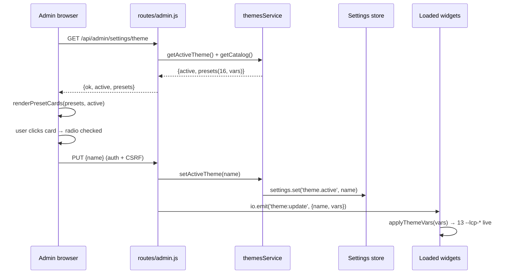

# Design: Theme Catalog Expansion — 16 presets + visual thumbnails

## Context / Goals / Non-Goals

**Scope**: widget-only theming (the 13 `--lcp-*` CSS custom properties) and the admin Appearance tab. Catalog is code-as-data in `THEME_PRESETS`; persistence stores only the active name string, so expansion needs no DB migration. Hot-change (PUT → `io.emit('theme:update')` → widget `applyThemeVars`) already works — this change verifies it, never reworks it.

**Goals**: 16-preset catalog; one pure-CSS mini-widget thumbnail per card; cards rendered dynamically from the GET `/api/admin/settings/theme` payload (already ships `presets` with `vars` — no server-route change); `auto` keeps `vars:null` with a placeholder preview.

**Non-goals**: no `widget.js` changes; no new CSS vars beyond the 13; no server-side thumbnail images; no theme upload; no admin-panel chrome theming; no changes to `src/routes/admin.js`, `server.js`, `db.js` (verified — admin.js L696-729, CSP `styleSrc` unsafe-inline at server.js L189-191, widget.js L534-548/L949-956 all untouched).

## Technical Approach

### (a) Catalog — code-as-data in `THEME_PRESETS`

Add 10 presets to `src/services/themes.js` `THEME_PRESETS` (L3-110). Existing 6 stay byte-identical; `auto` stays `vars:null`. All new presets use the shared Inter stack: `Inter, system-ui, -apple-system, BlinkMacSystemFont, "Segoe UI", sans-serif`. The conformance gate (themes.test.js L101-128) auto-enforces the 13-key/13-string contract once presets exist.

| Preset (type) | color | panelBg | surfaceBg | inputBg | inputTextColor | inputPlaceholderColor | textColor | mutedColor | borderColor | headerBg | headerColor | shadow |
|---|---|---|---|---|---|---|---|---|---|---|---|---|
| `light-sunrise` (light) | `#f97316` | `#ffffff` | `#fff7ed` | `#fffaf0` | `#431407` | `#b45309` | `#431407` | `#b45309` | `rgba(249,115,22,0.15)` | `#f97316` | `#ffffff` | `0 24px 80px rgba(249,115,22,0.18)` |
| `light-sky` (light) | `#0284c7` | `#ffffff` | `#f0f9ff` | `#fafcfe` | `#0c4a6e` | `#94a3b8` | `#0c4a6e` | `#64748b` | `rgba(2,132,199,0.15)` | `#0284c7` | `#ffffff` | `0 24px 80px rgba(2,132,199,0.18)` |
| `dark-ocean` (dark) | `#38bdf8` | `#0d1b2a` | `#16283c` | `#0d1b2a` | `#e0f2fe` | `#64748b` | `#e0f2fe` | `#94a3b8` | `rgba(56,189,248,0.18)` | `#16283c` | `#e0f2fe` | `0 24px 80px rgba(0,0,0,0.5)` |
| `dark-forest` (dark) | `#4ade80` | `#0d1a12` | `#16251b` | `#0d1a12` | `#ecfdf5` | `#64748b` | `#ecfdf5` | `#94a3b8` | `rgba(74,222,128,0.18)` | `#16251b` | `#ecfdf5` | `0 24px 80px rgba(0,0,0,0.5)` |
| `mono-light` (light) | `#18181b` | `#ffffff` | `#f4f4f5` | `#ffffff` | `#18181b` | `#a1a1aa` | `#18181b` | `#71717a` | `rgba(24,24,27,0.1)` | `#18181b` | `#ffffff` | `0 24px 80px rgba(0,0,0,0.16)` |
| `mono-dark` (dark) | `#6b7280` | `#18181b` | `#27272a` | `#18181b` | `#fafafa` | `#71717a` | `#fafafa` | `#a1a1aa` | `rgba(255,255,255,0.1)` | `#27272a` | `#fafafa` | `0 24px 80px rgba(0,0,0,0.5)` |
| `green-chat` (light) | `#25D366` | `#ffffff` | `#e6f9ef` | `#f4fbf7` | `#111b21` | `#8696a0` | `#111b21` | `#667781` | `rgba(37,211,102,0.18)` | `#075E54` | `#ffffff` | `0 24px 80px rgba(7,94,84,0.22)` |
| `sky-chat` (light) | `#2AABEE` | `#ffffff` | `#e5f3fb` | `#f2f9fd` | `#0a1b26` | `#94a3b8` | `#0a1b26` | `#64748b` | `rgba(42,171,238,0.18)` | `#2AABEE` | `#ffffff` | `0 24px 80px rgba(42,171,238,0.18)` |
| `gradient-vibrant` (light) | `#d62976` | `#ffffff` | `#fdf2f8` | `#fef9fb` | `#3b0764` | `#a855f7` | `#3b0764` | `#a855f7` | `rgba(214,41,118,0.18)` | `linear-gradient(135deg,#fa7e1e,#d62976 50%,#962fbf)` | `#ffffff` | `0 24px 80px rgba(150,47,191,0.25)` |
| `ink` (light) | `#000000` | `#ffffff` | `#f7f7f7` | `#ffffff` | `#000000` | `#71717a` | `#000000` | `#6b7280` | `rgba(0,0,0,0.12)` | `#000000` | `#ffffff` | `0 24px 80px rgba(0,0,0,0.2)` |

Notes: `headerBg` accepts any valid CSS background (gradient-vibrant uses one; widget `#lcp-header { background: var(--lcp-header-bg) }` renders it). `color` drives user bubble/send button where the widget hardcodes white text — brand-faithful accents (`#25D366`, `#2AABEE`) are low-contrast with white; accepted for brand identity (ADR-3 note). `mono-dark` uses gray `#6b7280` (not white) so bubbles stay legible on dark.

### (b) Thumbnails — client-side pure-CSS preview

A `.theme-preview` mock (mini header bar + avatar dot + user/bot bubble rows + input row) in a ~40-line static CSS block inside `admin.html`, styled via `var(--lcp-*)` mirroring widget.js selectors (header `background: var(--lcp-header-bg)`; user bubble `background: var(--lcp-color)`; panel `background: var(--lcp-panel-bg)`; input border `var(--lcp-border-color)`). Each rendered thumbnail root gets its preset's 13 vars as inline custom properties via `el.style.setProperty('--lcp-…', value)` — CSP-safe (`styleSrc 'unsafe-inline'` confirmed). `auto` (`vars:null`) renders `.theme-preview--auto`: a browser-window frame + site-palette swatch graphic + caption, never a var-built palette.

### (c) Dynamic cards

`renderPresetCards(presets, active)` replaces the 6 static `label.theme-card` blocks (admin.html L402-432). Card = `label.theme-card[data-theme=name]` wrapping radio `input[name="theme-preset"][value=name]` (checked when `name === active`), the thumbnail, and a label from `t('theme.' + name.replace(/-/g,'_'))` guarded against the raw-key fallback (admin.html L482 `t()` returns the key itself when missing — spec forbids rendering it; fall back to `preset.label`). `loadThemeSettings` (L1468-1482) calls `renderPresetCards(res.presets, res.active)`; the save-button handler (L1484-1508) is unchanged — it reads the checked radio and PUTs.

### (d) i18n

11 new keys × 5 dicts (L465-469): `theme.light_sunrise`, `theme.light_sky`, `theme.dark_ocean`, `theme.dark_forest`, `theme.mono_light`, `theme.mono_dark`, `theme.green_chat`, `theme.sky_chat`, `theme.gradient_vibrant`, `theme.ink`, `theme.preview`. Convention: kebab→underscore (matches existing `theme.light_aurora`). French dict uses U+2019 (`'`) for apostrophes (existing convention, e.g. `l'état`). EN labels (source of truth): Light Sunrise, Light Sky, Dark Ocean, Dark Forest, Mono Light, Mono Dark, Green Chat, Sky Chat, Gradient Vibrant, Ink, Preview.

## Architecture Decisions

| # | Decision | Choice | Alternatives | Rationale |
|---|---|---|---|---|
| ADR-1 | Catalog-as-data, no migration | Extend `THEME_PRESETS` constant; DB stores only the name | DB table of themes; JSON config file | Code-as-data matches existing persistence (`settings.theme.active`); unknown name falls back to `auto` in `getActiveTheme()`; zero schema risk |
| ADR-2 | Fully-dynamic card rendering | `renderPresetCards(payload.presets)`; delete static markup | Hybrid static+dynamic (keep 6 static, render extras) | Future themes become data + i18n keys only; single source of truth; deliberate admin-theme-tab test break is a feature |
| ADR-3 | Pure-CSS inline-style thumbnails | `.theme-preview` mock, vars as inline custom properties | Canvas, SVG, server-generated images | Pixel fidelity with the widget (same vars), zero server assets, scales to N themes; CSP-safe; contrast caveats above |
| ADR-4 | Neutral brand naming | `green-chat`/`sky-chat`/`gradient-vibrant`/`ink` labels | WhatsApp/Telegram/Instagram/X names | Avoids trademark sensitivity; palette still evokes the brand; user-approved |
| ADR-5 | Test strategy | Extend conformance gate + rewrite static `data-theme` asserts to dynamic contract | Freeze static test | Gate auto-covers new presets (13-key contract); admin-theme-tab asserts rendering function + 16-card payload contract instead of dead static markup |

## Sequence Diagram



## Interfaces / Contracts

```js
// admin.html (client)
renderPresetCards(presets /* {name,label,type,vars}[] */, active /* string */) // → fills #theme-presets-container
// var mapping mirrors widget.js applyThemeVars L534-548 (theme.X → --lcp-X); NO widget.js change
```

## File Changes

| File | Action | Description |
|---|---|---|
| `src/services/themes.js` | Modify | +10 presets in `THEME_PRESETS` (13-var maps from table above); exports unchanged |
| `public/admin.html` | Modify | Replace static cards L402-432 with `renderPresetCards`; add `.theme-preview` CSS + render JS; update `loadThemeSettings` L1468-1482; +11 i18n keys × 5 dicts |
| `tests/themes.test.js` | Modify | Extend `expectedPresets` (L102) to all 16 names; assert count 16; gate already loops all presets |
| `tests/admin-theme-tab.test.js` | Modify | Rewrite L17-26 static `data-theme` asserts → assert `renderPresetCards` presence + payload-driven contract; extend i18n test (L28-44) with 16 `theme.*` keys + `theme.preview`; add preview-render string tests |
| `package.json` | No change | No new test file; `npm test` (L11) is an explicit file list — both suites already listed |

## Migration / Rollout / Rollback

No DB migration (name-only persistence; `getActiveTheme()` falls back to `auto` on unknown names). Rollback is independent per commit: revert the `themes.js` commit removes the 10 presets; revert the `admin.html` commit restores static cards. `settings.theme.active` values set to new names degrade to `auto` — safe.

## Threat Matrix

N/A — no routing, shell, subprocess, VCS/PR automation, executable-file classification, or process-integration boundary introduced. Existing theme PUT auth/CSRF (`requireAdmin` + `requireCsrf`, admin.js L728-729) is unchanged; GET endpoints remain admin-only. No new attack surface: thumbnails render only server-provided preset vars.

## Testing Strategy

| Layer | What | Approach |
|---|---|---|
| Unit (RED→GREEN) | `themes.test.js` conformance gate | RED: `expectedPresets` extended to 16 before catalog change → GREEN after; gate loops all presets enforcing 13 keys/strings/`auto:null` |
| Unit (RED→GREEN) | `admin-theme-tab.test.js` L17-26 | Deliberate RED on dynamic render → rewrite to assert `renderPresetCards` in `loadThemeSettings` and that static card markup is gone; add preview string asserts (`.theme-preview` uses `var(--lcp-*)`, auto placeholder branch) |
| Unit | i18n coverage ×5 langs | Extend L28-44 to require all 16 `theme.<name>` keys + `theme.preview` per dict |
| E2E (container) | Hot-change verify | Admin API `PUT {name:'green-chat'}` → assert 200, persisted name, `theme:update` payload; loaded widget applies new vars live (ground truth widget.js L949-956, unchanged) |

## Open Questions

None blocking. (Known accepted caveat: brand-faithful light accents `#25D366`/`#2AABEE` have low white-text contrast on the user bubble — inherent to the fixed 13-var contract and the widget's hardcoded `#fff` bubble text; documented in ADR-3, not fixed here.)
